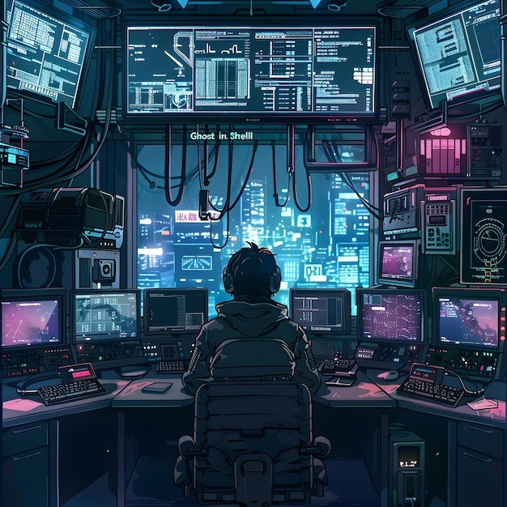
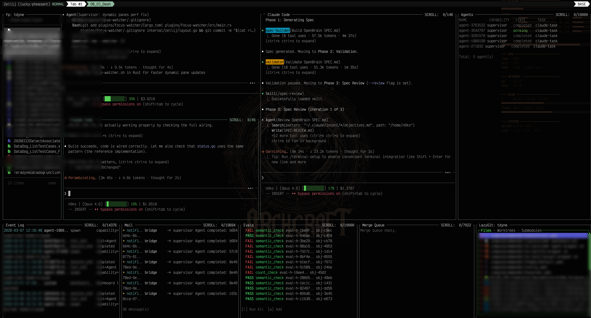

<!--
 ██████╗ ██████╗ ███╗   ███╗██████╗ ██╗   ██╗████████╗███████╗
██╔════╝██╔═══██╗████╗ ████║██╔══██╗██║   ██║╚══██╔══╝██╔════╝
██║     ██║   ██║██╔████╔██║██████╔╝██║   ██║   ██║   █████╗
██║     ██║   ██║██║╚██╔╝██║██╔═══╝ ██║   ██║   ██║   ██╔══╝
╚██████╗╚██████╔╝██║ ╚═╝ ██║██║     ╚██████╔╝   ██║   ███████╗
 ╚═════╝ ╚═════╝ ╚═╝     ╚═╝╚═╝      ╚═════╝    ╚═╝   ╚══════╝

 ██████╗ ██████╗ ███╗   ███╗███╗   ███╗ █████╗ ███╗   ██╗██████╗ ███████╗██████╗
██╔════╝██╔═══██╗████╗ ████║████╗ ████║██╔══██╗████╗  ██║██╔══██╗██╔════╝██╔══██╗
██║     ██║   ██║██╔████╔██║██╔████╔██║███████║██╔██╗ ██║██║  ██║█████╗  ██████╔╝
██║     ██║   ██║██║╚██╔╝██║██║╚██╔╝██║██╔══██║██║╚██╗██║██║  ██║██╔══╝  ██╔══██╗
╚██████╗╚██████╔╝██║ ╚═╝ ██║██║ ╚═╝ ██║██║  ██║██║ ╚████║██████╔╝███████╗██║  ██║
 ╚═════╝ ╚═════╝ ╚═╝     ╚═╝╚═╝     ╚═╝╚═╝  ╚═╝╚═╝  ╚═══╝╚═════╝ ╚══════╝╚═╝  ╚═╝
-->
<div align="center"></div>

<div align="center">

[](https://go.dev)
[](https://www.rust-lang.org)
[](https://zellij.dev)
[](https://github.com/charmbracelet/bubbletea)

</div>

*An agentic IDE for AI coding agent swarms*

---

```
╔═══════════════════════════════════════════════════════╗
║  PROJECT_NAME   = "computeCommander"                  ║
║  VERSION        = "0.1.0"                             ║
║  LICENSE        = "MIT"                               ║
║  LANGUAGE       = "Go 1.25 + Rust (focus-watcher)"    ║
║  ARCHITECTURE   = "Zellij KDL + BubbleTea TUI"        ║
╚═══════════════════════════════════════════════════════╝
```

<div align="center">
  
</div>

---

## > features --table

| Feature | Description |
|---|---|
| Multi-pane dashboard | File picker, agent session, agents table, event log, mail, merge queue, git status, evals, lazygit — all in one zellij layout |
| Session persistence | Autosave and restore with `--restore` / `--restore-force` flags |
| Rust focus-watcher | `/proc`-based watcher for fast dynamic pane focus updates without shell polling |
| Agent mail system | Structured inter-agent messaging with an in-dashboard mail summary pane |
| Intelligent merge queue | Conflict-aware FIFO queue with 4-tier conflict resolution per agent worktree |
| Git worktree isolation | Each agent gets its own worktree — no branch collisions, clean parallel execution |
| Cost tracking | Real-time token cost accumulation displayed in the agents panel |
| fsnotify refresh | Instant file-picker pane updates via `fsnotify`-triggered `SIGUSR1` |
| BubbleTea TUI fallback | Full in-process TUI mode when a raw terminal is preferred over zellij |
| Evals pane | Registered eval definitions with live pass/fail results wired to the intent eval hook |
| HTTP API gateway | REST `/api/v1/` for agents, mail, merge queue, and costs |
| 3-tier watchdog | Automatic health monitoring with soft/hard nudge and zombie detection |

---

## > architecture --diagram

```
┌─────────────┬──────────────────────────────────────┬──────────────────┐
│ File Picker │         Agent Session (PTY)           │   Agents + Cost  │
│  (fp PTY)   │   claude --dangerously-skip-perms…   │   agent table    │
│   ~15% w    │            ~65% w                     │     ~20% w       │
├─────────────┴──────────────────────────────────────┴──────────────────┤
│                          ~70% height                                   │
├──────────┬────────────┬──────────────┬─────────────┬──────────────────┤
│ Event    │   Mail     │  Merge Queue │  Git Status │  Evals / LazyGit │
│ Log      │  Summary   │              │             │                  │
│  ~20% w  │   ~20% w   │    ~20% w    │   ~20% w    │     ~20% w       │
└──────────┴────────────┴──────────────┴─────────────┴──────────────────┘
                          ~30% height
```

**Runtime flow:**

```
cmdr
  └─> runInit()
        └─> syscall.Exec → cmdr dashboard
              ├─> zellij action new-tab --layout cmdr-dashboard.kdl   (default)
              └─> bubbletea TUI (--tui flag)
                    ├─> focus-watcher  (Rust, /proc-based)
                    ├─> fsnotify → SIGUSR1 → file picker refresh
                    ├─> agent gateway  (HTTP /api/v1/)
                    └─> SQLite / PostgreSQL  (platform/db + migrations)
```

---

## > prerequisites --check

```sh
go version        # 1.22 or later (built with 1.25)
zellij --version  # 0.43.1 or later
cargo --version   # optional — only needed to rebuild focus-watcher from source
```

- **Go 1.22+** — core runtime
- **Zellij 0.43+** — multiplexer backend for the multi-pane layout
- **Rust / Cargo** *(optional)* — rebuild `plugins/focus-watcher` from source; a pre-built binary is included

---

## > install

<details>
<summary>Build from source</summary>

```sh
git clone https://github.com/Nokodoko/computeCommander
cd computeCommander

# Build the main binary
go build -o cmdr ./cmd/cc/

# (Optional) Rebuild the Rust focus-watcher plugin
cd plugins/focus-watcher
cargo build --release
cp target/release/focus-watcher ../../.computecommander/scripts/
```

</details>

Place `cmdr` somewhere on your `$PATH`:

```sh
mv cmdr ~/.local/bin/
```

Initialise a project:

```sh
cd your-project
cmdr init
```

---

## > usage --help

```sh
cmdr                             # launch dashboard (init + open zellij tab)
cmdr dashboard                   # open dashboard directly
cmdr dashboard --tui             # force BubbleTea TUI (no zellij)
cmdr session --restore           # restore last saved session
cmdr session --restore-force     # restore, overwriting current session
cmdr evals                       # list eval definitions and results
cmdr evals --run                 # run all evals
cmdr merge list                  # show merge queue
cmdr agents list                 # list active agents
cmdr status                      # fleet status (all capabilities)
cmdr doctor                      # health checks (config, db, git, zellij)
```

**Dashboard key bindings (BubbleTea TUI):**

| Key | Action |
|---|---|
| `Tab` / `Shift+Tab` | Cycle pane focus |
| `1`–`8` | Jump to numbered pane directly |
| `Ctrl+K` | Command palette |
| `r` | Run all evals *(Evals pane focused)* |
| `a` | Add eval definition *(Evals pane focused)* |
| `j` / `k` | Navigate agent table up/down |
| `Ctrl+C` | Quit |

---

## > config --file

computeCommander reads from `.computecommander/config.yaml` in the project root with an optional `config.local.yaml` overlay merged on top. Environment variables expand via `${VAR}` patterns and the file hot-reloads on change via fsnotify.

```yaml
# .computecommander/config.yaml
project:
  name: my-project
  canonical_branch: main

database:
  driver: sqlite          # or "postgres"
  path: .computecommander/cmdr.db

agents:
  max_concurrent: 4
  stagger_delay_ms: 500
  base_dir: .worktrees

merge:
  strategy: auto          # auto | manual | rebase

focus_watcher:
  enabled: true
  pid_file: .computecommander/focus-watcher.pid

watchdog:
  tier0_interval_ms: 5000
  stale_threshold_ms: 120000
  zombie_threshold_ms: 300000
```

---

## > attribution

Inspired by Jaymin West's [Overstory](https://github.com/jayminwest/overstory) — uses parts of his architecture to power this build.

---

## > contributing

1. Fork the repo and create a feature branch off `main`
2. Follow existing package and naming conventions — each command lives in its own file exporting `XxxCmd(app *App) *cobra.Command`
3. Keep changes minimal — one clear responsibility per PR
4. Run `go test ./...` before opening a pull request
5. Open a PR against `main` with a concise description of what and why

---


<div align="center">

[](LICENSE)

</div>
