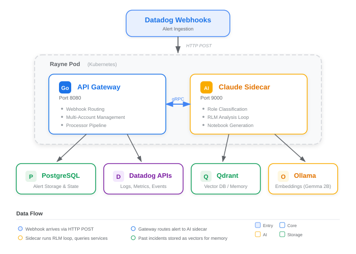

# We Built an AI That Learns From Every Incident

What if your monitoring system could think?

Not just fire alerts -- but actually investigate them. Pull the right logs. Check similar past incidents. Write up a root cause analysis. And create a fully hyperlinked investigation notebook -- all before an engineer opens their laptop.

That is exactly what we built.

---

## The Problem Every SRE Team Knows

Alert fatigue is not a buzzword. It is the reality of operating at scale.

When a high-volume alerting pipeline fires hundreds of webhooks per day, the human bottleneck is not detection -- it is investigation. Every alert demands the same ritual: open Datadog, find the monitor, pull the logs, check the hosts, cross-reference recent deployments, look for similar past incidents, and write up findings. For a veteran engineer, that is 15-30 minutes of context assembly before the actual diagnosis even begins.

Now multiply that across a 24/7 operations team. The tribal knowledge problem compounds it further -- the engineer who resolved a nearly identical issue last quarter is asleep, and their investigation notes live in a Slack thread that nobody can find.

We asked a different question: what if we could automate the investigation itself?

---

## The Architecture: A Claude Sidecar for Observability

We built **rayne** -- a Go-based API gateway that sits in front of Datadog and adds an AI-powered root cause analysis layer. The name stands for **Root-cause Agent Yielding Narrowed Explanations**, and the architecture follows a pattern we call the **Claude sidecar model**.



Here is how it works:

**1. Webhook Ingestion and Routing**

Rayne receives Datadog webhooks through a Go HTTP server. Every incoming alert is stored in PostgreSQL and routed through a pluggable processor pipeline. Processors run in tiers -- fast operations (desktop notifications, Slack alerts, webhook forwarding) execute in parallel as Tier 1, while the AI analysis runs as Tier 2 with bounded concurrency.

The system supports multi-account Datadog management. A single rayne instance can handle webhooks from US Government, Commercial, and EU Datadog organizations, resolving the correct API credentials per webhook based on org routing.

**2. Intelligent Alert Classification**

Not every alert needs the same kind of investigation. Before the AI touches an alert, a **Role Classifier** examines the monitor type, tags, service name, and hostname to route it to the right specialist:

- **Infrastructure** agents handle host, process, and metric alerts
- **Application** agents handle APM, RUM, and error tracking alerts
- **Database** agents handle DBM and storage alerts
- **Network** agents handle synthetics and load balancer alerts
- **Watchdog** agents handle Datadog's anomaly detection monitors
- **Logs** agents handle log-based alerts

This classification is not AI-powered -- it is a deterministic rules engine. Fast, predictable, and debuggable. The AI only activates once the right specialist is selected.

**3. The RLM Loop: Plan, Query, Analyze, Conclude**

The core analysis engine implements what we call the **Recursive Language Model (RLM) pattern** -- an iterative loop where an AI agent plans its investigation, executes queries, analyzes results, and decides whether it has enough evidence to conclude or needs another iteration.

```
   Plan  -->  Query  -->  Analyze
    ^                        |
    |                        |
    +--- Need more data? ----+
              |
         Conclude (when complete)
```

Each iteration:
- **Plan**: The agent determines what data it needs (logs, host metrics, recent events, monitor configuration)
- **Query**: Sub-agents fan out concurrently to fetch data from Datadog APIs using a Python tool library
- **Analyze**: Claude processes the fetched context alongside the alert payload
- **Conclude**: If the root cause is identified, the loop terminates. Otherwise, it plans the next iteration.

The loop is bounded -- a configurable maximum iteration count (default: 5) prevents runaway analysis. A semaphore limits concurrent analyses to prevent resource exhaustion.

**4. Pre-Fetched Context: The Key to Quality Analysis**

Raw LLM analysis of an alert payload produces mediocre results. The difference-maker is context. Before Claude sees an alert, the system pre-fetches:

- Error logs from the affected host and service
- Recent Datadog events (deployments, configuration changes)
- Host information (tags, metadata, resource utilization)
- Monitor configuration (thresholds, query definition)
- Similar past incidents from the vector database (more on this below)

This pre-fetched context transforms a generic "high CPU" alert into a rich investigation package: "CPU spiked to 95% on web-server-01 at 14:32, coinciding with a deployment at 14:28, and this host had a similar spike last Tuesday that was caused by a memory leak in the session cache."

---

## Incident Memory: Learning from Every Investigation

This is where the system gets genuinely interesting.

Every completed root cause analysis is embedded into a vector and stored in **Qdrant**, an open-source vector database. The embeddings are generated locally by **Ollama** running the Gemma 2B model -- no data leaves the cluster.

When a new alert arrives, the system:

1. Generates an embedding of the alert context
2. Searches Qdrant for the top 5 most similar past incidents (cosine similarity)
3. Includes those past RCA results in the Claude analysis prompt

The stored vectors include rich metadata: monitor ID, service name, hostname, application team, alert status, and the full analysis text. Over time, the system builds an institutional memory of incidents -- the kind of tribal knowledge that typically exists only in senior engineers' heads.

The embedding dimensions (2048 via Gemma 2B) capture semantic similarity rather than keyword matching. An alert about "connection pool exhaustion" will surface past incidents about "database connection timeouts" even if the exact wording differs.

---

## Auto-Generated Notebooks: Actionable Output

Analysis alone is not enough. Engineers need a starting point for their investigation -- with links, not just text.

For every alert that triggers analysis, rayne automatically creates a **Datadog Notebook** -- a collaborative investigation document with:

- **Hyperlinked monitor** -- one click to the triggering monitor
- **Log search queries** -- pre-built queries filtered to the affected host and timeframe
- **Host dashboard links** -- direct navigation to infrastructure metrics
- **Service overview links** -- APM and service-level dashboards
- **AI analysis section** -- the root cause findings with severity assessment and recommendations
- **Similar incident references** -- links to past related investigations

The notebook follows a lifecycle: **Active** when created, transitioning to **Investigating** during analysis, and updated to **Resolved** when a recovery webhook arrives. This lifecycle tracking means the notebook is a living document, not a one-shot artifact.

Each notebook is titled with the monitor name and timestamp, truncated to Datadog's 80-character limit, and tagged with environment and service metadata for discoverability.

---

## The Infrastructure: Kubernetes-Native

Rayne deploys as a Kubernetes pod with two containers:

- **Rayne Go API** (port 8080): The API gateway handling webhooks, multi-account management, RUM tracking, and Datadog API proxying
- **Claude Agent Sidecar** (port 9000): A Node.js server wrapping Claude Code CLI invocations with Qdrant and Ollama integration

Supporting services (PostgreSQL, Qdrant, Ollama) run as separate pods. The full stack requires approximately 12GB of memory for a development deployment on minikube, with Ollama being the heaviest consumer due to local model inference.

Authentication supports dual modes: OAuth long-term tokens via Claude Code's native credential system, or direct API key authentication. The sidecar handles token refresh automatically, including detection of expiring tokens and proactive renewal.

---

## Why This Matters for Observability

The observability industry is at an inflection point. We have spent a decade getting better at *collecting* data -- metrics, logs, traces, profiles. The next decade is about *understanding* that data automatically.

What rayne demonstrates is not just "we added AI to our alerting pipeline." It is a design pattern -- the **AI sidecar** -- that has broader implications:

- **Deterministic routing + AI analysis**: Use fast, predictable rules to classify and route. Use AI only where human-like reasoning is needed.
- **Context is king**: LLMs without domain context produce generic answers. Pre-fetching operational data before analysis is the difference between useful and useless output.
- **Institutional memory as vectors**: Every investigation makes the next one better. This is the compound interest of AI-assisted operations.
- **Living documentation**: Auto-generated notebooks that update through an incident's lifecycle eliminate the "write a postmortem later" problem.

---

## Looking Ahead

We are actively expanding rayne's capabilities:

- **GitHub issue processing**: The same sidecar architecture now processes GitHub issue webhooks, using Claude to analyze reported issues against a knowledge base of Go best practices (also stored in Qdrant)
- **LLM Observability**: Full Datadog LLMObs integration traces every AI invocation -- model, prompt, response, latency -- creating an observability loop for the observability system itself
- **Failure alerting**: When the AI analysis itself fails, rayne creates a Datadog event and a failure-specific notebook, ensuring that meta-failures are visible

---

*Interested in implementing AI-powered observability in your organization? We would love to hear how your team is approaching the intersection of AI and incident response. Drop a comment or reach out.*

#AI #Observability #DevOps #SRE #SystemDesign #Datadog #IncidentManagement #MachineLearning #AIOps #CloudNative
