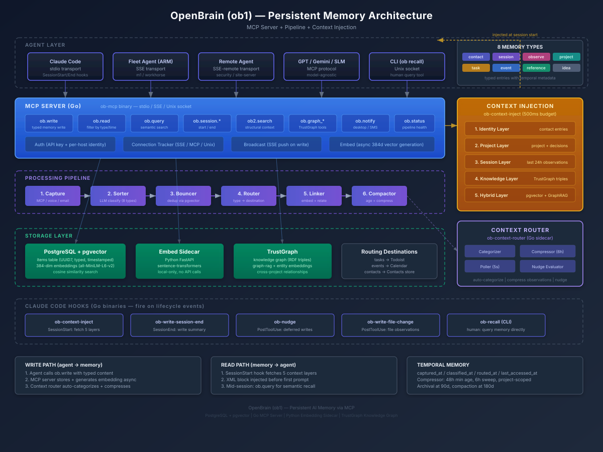

# Your AI Has No Memory — Here's How I Fixed That

## Post Blurb (Feed Teaser)

Your AI has no memory.

Every session starts from zero. Every conversation is a blank slate. Your agents cannot remember what they learned yesterday, who they spoke to last week, or the architectural decision they made three hours ago. You are paying for intelligence that forgets everything the moment the context window closes.

I built a persistent memory system that gives any AI model — Claude, GPT, Gemini, local SLMs — instant recall across sessions, temporal awareness, and pattern matching over months of accumulated context. Here is how it works.

---

## The Amnesia Tax

There is a hidden cost to every AI-assisted workflow that nobody puts on a dashboard: the amnesia tax.

Every time you start a new session with an AI agent, you pay it. You re-explain your codebase structure. You re-describe your preferences. You re-establish the decisions you already made. You paste in context that the agent had yesterday but lost overnight.

I measured it across my own workflows: roughly 15-25% of every session is spent re-establishing context that the agent already possessed in a previous session. Over weeks of heavy daily usage, that compounds into days of wasted compute and human attention.

The industry's current answer is longer context windows. 200k tokens. A million tokens. The assumption is that if you can fit more into a single session, the amnesia problem goes away. But it does not. Context windows are session-scoped. They evaporate. You cannot carry 200k tokens of hard-won project knowledge into tomorrow's session.

Some teams have turned to JSONL files — append-only logs of conversations, decisions, and context fragments. This is better than nothing. But a flat file with thousands of timestamped lines has no concept of relevance, no semantic search, no temporal decay, and no way for an agent to ask "what do I know about this topic?" and get a ranked answer in milliseconds.

I needed something fundamentally different. I needed a second brain.

---

## OpenBrain: Memory as Infrastructure

OpenBrain (ob1) is the persistent memory system I built to solve the amnesia problem. It runs as infrastructure — a Go-based MCP server backed by PostgreSQL with pgvector, a Python embedding sidecar, and an opportunistic context router — and exposes memory as a set of tools that any AI model can call.

The key architectural decision: memory is not a file. Memory is a service with typed entries, temporal metadata, semantic embeddings, and a pipeline that continuously classifies, routes, links, and compresses what the system knows.

Any agent that speaks MCP can connect. Claude Code sessions connect via hooks that fire on SessionStart and SessionEnd. But the same MCP server serves a fleet of machines — my primary workstation, ARM development boards, headless servers — all writing to and reading from the same memory pool. The agent on my laptop and the agent on a remote build server share the same brain.

---

## The Eight Types of Memory

Not all memories are the same. A contact record, a session summary, and a fleeting observation about a test failure serve different purposes and have different lifespans. OpenBrain classifies every entry into one of eight typed categories:

### Contact

People, hosts, fleet machines, communication preferences. When an agent encounters a new collaborator or learns that a teammate prefers async communication, that becomes a contact entry. Contact entries also store my own preferences — coding style, type safety requirements, tool choices — so every new session inherits my identity without me re-explaining it.

Contact entries have the longest lifespan. They rarely decay. They form the identity layer that gets injected into every session on startup.

### Session

Structured summaries of completed work sessions. When a Claude Code session ends, a hook fires that extracts metadata — project name, host machine, duration, files modified, tool calls made, key outcomes — and writes a session entry to OpenBrain. The next session on the same project gets a "previously on..." context injection showing what happened last time.

Session entries are the connective tissue between conversations. They answer the question: "What was I doing yesterday on this project?"

### Observation

The most interesting type. Observations are things the agent noticed — test results, performance regressions, architectural patterns, recurring bugs, dependency issues. Unlike sessions (which summarize completed work), observations capture insights that might be relevant later.

An agent might observe: "The auth module's test suite takes 45 seconds because it spins up a real Redis instance instead of using mocks." That observation sits in OpenBrain. Three weeks later, when a different agent is working on CI optimization, a semantic search for "slow tests" surfaces that observation with its original timestamp and context.

Observations are candidates for compression. After 48 hours, the context router's compressor groups related observations by project scope and merges them into compressed snapshots, preserving the signal while reducing storage volume.

### Project

Per-project context — architecture decisions, tech stack information, deployment configurations, team structures. Project entries are scoped to specific codebases and surfaced when an agent opens a session in that project's directory.

### Task

Actionable items that get routed to external systems. When an agent identifies work that needs to happen, a task entry flows through the pipeline and gets routed to Todoist or similar task management tools. The task remains in OpenBrain as a reference even after routing.

### Event

Time-bound items — meetings, deadlines, release dates. Event entries get routed to calendar integrations while maintaining a record in the memory system.

### Reference

General knowledge items — documentation snippets, API references, configuration patterns. Reference entries also serve as the output type for the compressor: when multiple observations get compressed into a snapshot, the result is stored as a reference entry with source attribution.

### Idea

Speculative, low-priority captures — feature concepts, optimization hypotheses, "what if" thoughts. Ideas have the loosest structure and lowest urgency but participate fully in semantic search, meaning they surface when relevant work begins.

---

## The Pipeline: From Capture to Recall

Every entry flows through a six-stage pipeline that transforms raw text into searchable, linked, temporally-aware memory.

**Stage 1: Capture** — Items enter through multiple sources: MCP tool calls from agents (the primary path), voice transcription via Whisper, email ingestion, webhook payloads, or direct CLI input. Every item gets a UUID7 (time-ordered), a timestamp, and an initial status of "inbox."

**Stage 2: Sorter** — An LLM classifies the item into one of the eight types with a confidence score and extracted entities. The sorter uses Claude via litellm with a classification-specific system prompt, running at temperature 0.1 for consistency. If the LLM fails to parse, the item defaults to "reference" with zero confidence — it never gets stuck.

**Stage 3: Bouncer** — Duplicate detection using pgvector cosine similarity. If a new item is too similar to an existing entry (same semantic content, different wording), the bouncer flags it. Short or spam-like items also get filtered here. The bouncer prevents the memory system from accumulating redundant entries over time.

**Stage 4: Router** — This is where I covered the context router in the previous article, so I will keep this brief. The router maps item types to destinations: tasks go to Todoist, events go to the calendar, contacts go to the contacts store. Observations, references, ideas, and projects get forwarded to TrustGraph for knowledge graph enrichment. The router is deterministic — no LLM calls, just a type-to-destination map with tag-based refinement.

**Stage 5: Linker** — The embedding engine. Every item gets a 384-dimensional vector via all-MiniLM-L6-v2 running locally (no API calls, no data leaving the machine). These embeddings power semantic search: when an agent calls `ob.query` with natural language, the query text gets embedded and compared against every stored vector using pgvector's cosine distance operator. The linker also enriches items via TrustGraph for graph-based entity relationships.

**Stage 6: Compactor** — The memory maintenance stage. Stale items (older than 90 days for archival, 180 days for compaction) get progressively compressed. Archived items retain their content but exit active search results. Compacted items have their content truncated and embeddings cleared, preserving metadata while reclaiming storage.

---

## Why Not Just Use JSONL Files?

The JSONL approach is popular in the AI tooling community, and I understand why. It is simple: append a line of JSON for every interaction. You get a chronological log of everything that happened.

But JSONL files are missing four capabilities that make memory genuinely useful:

**1. No temporal awareness.** A JSONL file treats a line from three months ago and a line from three minutes ago identically. OpenBrain timestamps every entry with `captured_at`, `classified_at`, `routed_at`, and `last_accessed_at`. The context injection system prioritizes recent entries. The compressor ages out stale observations. Time is a first-class dimension of every memory.

**2. No semantic search.** Finding relevant context in a JSONL file means grep or substring matching. OpenBrain embeds every entry into a 384-dimensional vector space. When an agent needs to recall "that thing about the authentication module," it runs a semantic query that returns ranked results by cosine similarity — even if the exact words differ from the original entry. An observation about "JWT token expiration" surfaces when you search for "auth session timeout."

**3. No cross-session pattern matching.** JSONL files are typically per-session or per-project. OpenBrain is a unified memory pool across all sessions, all projects, and all machines in the fleet. An observation made during a security review three weeks ago on a different machine is immediately available to today's session working on the same codebase. Patterns that emerge over weeks or months — recurring test failures, architectural drift, dependency conflicts — become visible because all observations share the same searchable space.

**4. No real-time agent access.** JSONL files are passive. An agent cannot query them mid-conversation without custom tooling. OpenBrain exposes MCP tools — `ob.write`, `ob.read`, `ob.query`, `ob.status` — that any MCP-compatible agent can call in real time. The agent does not need to know the file format, the storage location, or the query syntax. It calls a tool and gets structured results.

That said, JSONL has real value as training data. The structured entries in OpenBrain can be exported to JSONL format for fine-tuning small language models. Every classified prompt, every observation, every session summary is a labeled training example. The future state includes a JSONL export pipeline specifically for SLM fine-tuning — using the memory system's curated data to train faster, cheaper classifiers.

---

## Immediate Recall: The Context Injection System

Memory is only useful if it reaches the agent before the agent needs it.

OpenBrain solves this with a SessionStart hook that fires every time a Claude Code session begins. The hook runs a Go binary (`ob-context-inject`) that fetches four context layers in parallel, all within a 500-millisecond budget:

**Identity Layer** — Fetches all `contact` entries to build a profile of the user: coding preferences, communication style, tool choices, team information. This layer answers "who am I working for?" before the agent sees the first prompt.

**Project Layer** — Queries `project` entries and recent `observation` entries tagged with the current working directory's project name. Includes recent architectural decisions (observations with decision-related tags). This layer answers "what is this project and what decisions have we made?"

**Session Layer** — Fetches the most recent `session` entries from the last 24 hours to provide temporal continuity. This layer answers "what happened in the last session?"

**Knowledge Layer** — Queries TrustGraph for graph-based relationships relevant to the current project — entity connections, dependency relationships, knowledge triples. This is the semantic enrichment layer.

**Hybrid Layer** — Runs a parallel pgvector semantic search and GraphRAG query, merging results for maximum context relevance.

All five layers assemble into an XML block that gets injected into the session context before the agent sees any user prompt. The agent starts every conversation with memory — not a blank slate.

---

## Pattern Matching Over Extended Periods

The most powerful capability is the one that takes time to build: pattern detection over weeks and months.

Individual observations are small signals. "Tests are slow on the auth module." "The deploy script fails on ARM hosts." "The API response times spike after 3pm." In isolation, each is a minor note.

But OpenBrain stores them all with timestamps, project tags, and semantic embeddings. Over time, the observation pool grows into a pattern-rich dataset. When an agent searches for "deployment issues," it does not get one result — it gets a timeline of related observations spanning weeks, revealing patterns that no single session could have noticed.

The context router's compressor accelerates this by grouping temporally proximate observations by project scope. A compressed snapshot that reads "Compressed 12 observations (computeCommander scope, 2026-03-01 to 2026-03-15)" preserves the trend while reducing noise.

TrustGraph integration adds graph-based pattern detection. When observations mention entities — specific modules, tools, people, infrastructure components — those entities become nodes in a knowledge graph. Relationships between entities reveal dependency patterns, ownership structures, and impact radiuses that flat text could never surface.

---

## Any Model Can Reference ob1

One design principle separates OpenBrain from project-specific context solutions: model agnosticism via MCP.

The MCP server exposes six core tools:

| Tool | Purpose |
|------|---------|
| `ob.write` | Write a typed memory item (any of the 8 types) |
| `ob.read` | Read items by ID, type, status, or time range |
| `ob.query` | Semantic search across all items via natural language |
| `ob.status` | Pipeline health, connection info, item counts |
| `ob.session.start` | Record a session boundary |
| `ob.session.end` | Record session end with summary |

Plus `ob.notify` for desktop/SMS notifications, `ob2.search` for structural project context (vectorless), `ob2.gate` for routing queries between semantic and structural search, and TrustGraph tools (`ob.graph_query`, `ob.graph_search`, `ob.triples`) for knowledge graph access.

Any model that supports MCP can connect. Claude Code connects via stdio transport. Remote agents on fleet machines connect via SSE or Unix socket transport. The server tracks connections per host, per transport tier, so I can see exactly which agents on which machines are currently reading from and writing to the memory pool.

This means switching models does not lose memory. If I move a workflow from Claude to a local model, or from one machine to another, the memory persists. The knowledge accumulated over months of Claude Code sessions is equally available to a GPT-based agent or a fine-tuned local SLM.

---

## What's Next

OpenBrain is production infrastructure that I use daily, but the roadmap has three major expansions:

**JSONL Export for SLM Fine-Tuning** — Every classified item is a labeled training example. The export pipeline will produce JSONL datasets segmented by task: prompt classification, type routing, confidence scoring, and context relevance ranking. These datasets will fine-tune sub-1B parameter models to replace the current regex and keyword classifiers with trained models that understand my specific domain vocabulary.

**TrustGraph Deep Integration** — The knowledge graph layer is functional but early. The next phase adds bidirectional sync: not just forwarding items to TrustGraph for enrichment, but pulling graph-derived insights back into the context injection pipeline. When TrustGraph detects that two projects share a critical dependency, that relationship should surface in both projects' context layers automatically.

**Temporal Decay and Relevance Scoring** — Currently, recency is the primary temporal signal. The next evolution adds decay curves: entries that have not been accessed or referenced lose relevance weight over time, while entries that keep getting hit in semantic searches gain weight. This creates an organic prioritization where genuinely useful memories float to the top without manual curation.

---

## The Real Differentiator

The AI industry is obsessed with making models smarter. Bigger parameters, longer context windows, faster inference. But the bottleneck for most AI-assisted workflows is not intelligence — it is continuity.

A model that remembers what it learned yesterday, who it worked with last week, and what patterns it noticed over the last month will outperform a model with 10x more parameters but zero memory. Context is not a nice-to-have. It is the difference between an AI assistant and an AI colleague.

OpenBrain is how I turned disposable AI sessions into a persistent, accumulating intelligence layer. Every session makes the next one better. Every observation feeds the pattern pool. Every agent on every machine contributes to the same shared memory.

Your AI has no memory. Maybe it should.

---

How are you solving the context persistence problem in your AI workflows? I am genuinely curious — are you using JSONL files, RAG pipelines, or something entirely different? Drop a comment or reach out.

---

#AI #SystemDesign #ContextEngineering #MachineLearning #AgentArchitecture #MCP #DevOps #KnowledgeGraph #SecondBrain #MemorySystems
