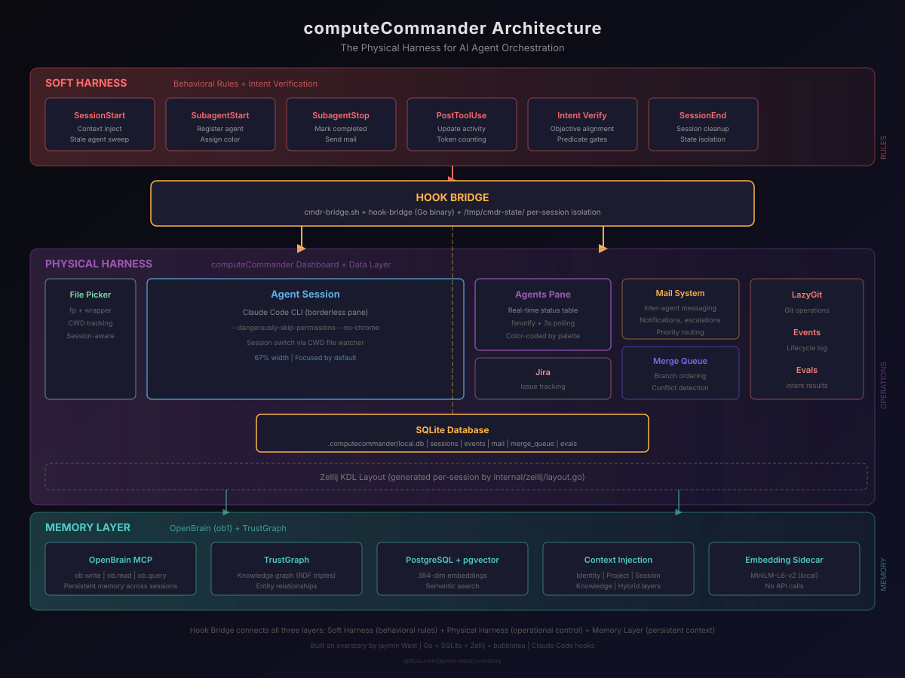

# The Missing Layer Between You and Your AI Agents

## Post Blurb (Feed Teaser)

You gave your AI agents intelligence. You gave them memory. But who is watching them?

When I run six AI agents in parallel -- each on a different branch, each modifying different files, each burning tokens at different rates -- I need more than a terminal window. I need a cockpit. I need real-time status. I need a mail system so agents can talk to each other. I need a merge queue so their branches do not collide. I need observability for the fleet, not just the individual.

I built that cockpit. It is called computeCommander, and it is the physical harness that turns a swarm of AI agents into something you can actually operate. Here is how it works.

---

## The Problem: AI Agents Are Invisible

The AI tooling ecosystem has a blind spot.

We have made extraordinary progress on intelligence. Models reason about code, write tests, navigate complex architectures, and make architectural decisions. We have made progress on memory -- my previous article covered OpenBrain, a persistent memory system that gives agents recall across sessions.

But there is a layer nobody talks about: the operational layer. The thing that answers basic questions about your running agents:

- How many agents are running right now?
- What is each one doing?
- How long has that agent been stuck?
- Did the agent on the auth module finish before the one on the database migration started its merge?
- Can I see the output of all six agents without opening six terminal tabs?

If you run a single AI agent in a single terminal, these questions do not matter. But the moment you scale to multi-agent workflows -- and you will, because parallel execution is the entire point of AI-assisted development -- you need answers. You need observability.

This is what DevOps figured out a decade ago for microservices. You do not run 30 services without a dashboard. You do not deploy without a pipeline. You do not operate without metrics. AI agents deserve the same infrastructure.

---

## computeCommander: The Physical Harness

computeCommander (cmdr) is the operational layer for AI agent workflows. It started as a fork of jaymin West's excellent **overstory** project -- a terminal UI for Claude Code sessions -- and evolved into a full agent orchestration harness.

The name is intentional. If OpenBrain is the agent's memory, and the hooks/intent system is the behavioral harness (rules, guardrails, verification), then computeCommander is the physical harness -- the cockpit where you see everything, control everything, and intervene when something goes wrong.

The architecture has four layers:



---

## Layer 1: The Dashboard

The dashboard is a zellij layout -- not a bubbletea TUI in a single terminal, but a real multiplexer layout where every pane runs its own native process. This was a deliberate architectural decision. We tried embedding PTY processes inside bubbletea and discovered that Claude Code's advanced terminal features (alternate screen buffers, complex ANSI sequences, interactive prompts) break when you virtualize the terminal. Zellij gives us real terminals with zero edge cases.

The layout:

```
+----------+------------------------------------------+-----------+
| Prompt   |                                          |           |
| (1 row)  |                                          |  Agents   |
+----------+     Agent Session (borderless)           |  (23%)    |
|          |          67% width                       |           |
|  fp      |          (focused)                       +-----------+
|  (10%)   |                                          |  Jira     |
|          |                                          |  (35%)    |
+----------+------------------------------------------+-----------+
| Events   | Evals | OpenBrain | TrustGraph |     LazyGit       |
|  (16%)   | (16%) |   (20%)   |   (20%)    |      (28%)        |
+----------+-------+-----------+------------+-------------------+
```

**Agent Session** (center, 67% width) -- The main Claude Code session. This is where you interact with the AI. It runs as a borderless pane so the agent gets maximum screen real estate for code, diffs, and tool output.

**File Picker** (left, 10% width) -- An embedded `fp` file picker that tracks the current project directory. When you switch sessions, the file picker updates to show the new project's tree. It is wired to a per-tab CWD file that a wrapper script watches.

**Agents** (right sidebar) -- Real-time agent status table. Shows every running agent's name, capability type (supervisor, builder, scout, code-review), state (working, completed, zombie), model, and assigned task. Color-coded by a palette that matches the internal color assignment system. This pane updates via fsnotify on the SQLite database plus a 3-second polling fallback.

**Events** -- Timestamped event log showing agent spawns, completions, errors, and system events. Every SubagentStart and SubagentStop hook fires an event into the database.

**Evals** -- Evaluation results from the intent verification system. Shows pass/fail status for behavioral guardrails.

**OpenBrain** -- Status display for the persistent memory system (article #2). Connection status, item counts, recent entries.

**TrustGraph** -- Knowledge graph visualization showing entity relationships across the codebase.

**LazyGit** -- Full lazygit integration for git operations. Watches the same per-tab CWD file so it follows session switches.

Every pane is generated by a Go function (`GenerateLayout` in `internal/zellij/layout.go`) that produces KDL configuration. The layout is regenerated every session -- there are no static layout files to maintain.

---

## Layer 2: The Hook Bridge

This is where computeCommander connects to the soft harness.

Claude Code exposes lifecycle hooks: `SessionStart`, `SessionEnd`, `SubagentStart`, `SubagentStop`, `PreToolUse`, `PostToolUse`. These hooks fire shell commands at specific moments in the agent lifecycle. computeCommander uses them as its nervous system.

The data flow:

1. Claude Code spawns a subagent (the `Task` tool fires)
2. The `SubagentStart` hook triggers `cmdr-bridge.sh`
3. `cmdr-bridge.sh` extracts the agent name, session ID, and capability from environment variables
4. It calls `hook-bridge`, a Go binary that writes the agent record to SQLite
5. The Go binary also emits an event and sends an inter-agent mail message ("Agent spawned: agent-3406923")
6. fsnotify on the database file triggers a refresh in the Agents pane
7. The dashboard updates in real time

When the agent completes, the same flow runs in reverse via the `SubagentStop` hook: the agent record transitions from `working` to `completed`, an event is emitted, and the dashboard updates.

The critical design decision here is **per-session state isolation**. Each Claude Code session gets its own state file (`active-${CLAUDE_SESSION_ID}.txt`) in `/tmp/cmdr-state/`. When a session ends, only that session's agents get cleaned up. We learned this the hard way -- an earlier design used a single shared file, and when any session ended (including dashboard restarts), it marked ALL agents from ALL sessions as completed. That was a fun debugging session.

The hook bridge also handles staleness detection. On `SessionStart`, it sweeps the database for agents that have been in `working` state for more than 30 minutes without a heartbeat, marking them as completed. This prevents phantom agents from cluttering the dashboard after crashes.

---

## Layer 3: The Mail System

AI agents need to communicate with each other. Not through shared files or environment variables, but through a structured messaging system with senders, recipients, subjects, priorities, and read receipts.

computeCommander's mail system is backed by SQLite (the same database as the agent registry) and exposed through both CLI and hooks:

```
cmdr mail send --from supervisor --to builder --subject "Auth module review" --body "..."
cmdr mail check --agent builder
cmdr mail list --unread
```

The hook bridge automatically sends mail notifications for lifecycle events. When a supervisor spawns a builder agent, the bridge sends a mail message to the supervisor's inbox: "Agent spawned: agent-3303053 (capability: builder)". When the builder completes, another message: "Agent completed: agent-3303053". The supervisor agent can check its mail to track the status of delegated work without polling the database directly.

Message types include: `notification`, `escalation`, `handoff`, and `directive`. Priorities: `low`, `normal`, `high`, `critical`. The mail system is the coordination backbone for multi-agent workflows where a supervisor dispatches work to specialists and needs to know when they finish, fail, or need help.

---

## Layer 4: The Merge Queue

When multiple agents work in parallel on the same codebase, their branches will eventually need to merge. Without coordination, this becomes a race condition. Agent A finishes first and merges. Agent B finishes second but its branch is now behind. Agent C rebases but introduces a conflict with Agent A's changes.

The merge queue prevents this:

```
cmdr merge enqueue feature/auth-refactor --task task-001 --agent builder-1
cmdr merge enqueue feature/db-migration --task task-002 --agent builder-2
cmdr merge list
cmdr merge run
```

Branches are enqueued with their associated task and agent. The queue processes entries in order -- first in, first out. Each merge runs through the standard git merge process. If a merge fails due to conflicts, it is flagged and the agent (or human) can resolve it before the queue advances.

The merge queue view in the dashboard shows the current queue state: pending branches, in-progress merges, completed merges, and failed merges. Combined with the agents pane, you can see exactly which agent produced which branch and where it sits in the merge pipeline.

---

## The Three Harness Model

The three articles in this series describe three layers of a complete AI agent harness:

**The Soft Harness** (article #1 -- rayne, hooks, intent) -- Behavioral rules. What agents can and cannot do. The intent verification system that gates every prompt. The hook pipeline that enforces supervision. The escalation gates that prevent unauthorized actions. This is the flight computer.

**The Memory Layer** (article #2 -- OpenBrain) -- Persistent context. What agents know and remember. The typed memory entries, semantic search, temporal decay, and cross-session pattern matching. This is the flight recorder.

**The Physical Harness** (article #3 -- computeCommander) -- Operational control. What you can see and touch. The dashboard, agent tracking, mail system, merge queue, and real-time observability. This is the cockpit.

All three layers connect through the hook bridge:

- Hooks fire on agent lifecycle events (soft harness enforces rules)
- Hook bridge writes agent state to SQLite (physical harness tracks agents)
- SessionStart/End hooks trigger OpenBrain context injection (memory layer provides recall)
- The intent system gates prompts before agents act (soft harness verifies alignment)
- The mail system carries coordination messages (physical harness enables communication)
- TrustGraph enriches observations with entity relationships (memory layer builds knowledge)

This is not three separate tools duct-taped together. It is a single integrated system where each layer serves a specific purpose and communicates through well-defined interfaces. The hook bridge is the nervous system connecting the brain (OpenBrain), the rules (intent/hooks), and the body (computeCommander).

---

## Why This Matters

The AI agent ecosystem is at the same inflection point that cloud computing hit around 2010. Individual tools work. Kubernetes did not exist because containers were broken -- it existed because operating containers at scale requires orchestration, scheduling, health checks, and observability.

AI agents are the containers. computeCommander is the orchestration layer.

Today, most developers interact with AI agents one at a time, in a single terminal. That is fine for simple tasks. But the moment you need parallel execution -- a supervisor dispatching work to specialists, each working on different modules, each producing branches that need to merge cleanly -- you need infrastructure.

You need to know which agents are running. You need to see when they stall. You need a communication channel between them. You need a merge pipeline that prevents branch collisions. You need a dashboard that gives you the same operational visibility you expect from any distributed system.

computeCommander is not the only answer. But it demonstrates that the answer exists at the infrastructure layer, not the model layer. Better models will not solve the orchestration problem. Better tooling will.

---

## Built on Overstory

computeCommander started as a fork of jaymin West's **overstory** project -- a beautifully designed terminal UI for Claude Code. Jaymin's work provided the foundation: the session management concepts, the bubbletea component architecture, and the project structure.

What I added was the operational layer: agent tracking via hooks, the SQLite-backed registry, the mail system, the merge queue, the zellij layout generator, and the bridge between Claude Code's lifecycle hooks and the dashboard. The core insight -- that AI agents need a terminal UI -- came from overstory. The extension -- that AI agents need fleet management -- came from running multi-agent workflows daily and needing answers to questions that no single terminal could provide.

If you are looking for a clean, focused Claude Code TUI without the full fleet management layer, check out overstory. If you need to operate a swarm, computeCommander is the next step.

---

## What's Next

The roadmap has three major directions:

**Multi-Machine Fleet Management** -- Currently, computeCommander tracks agents on a single machine. The next phase extends the SQLite database to support remote agents via OpenBrain's fleet MCP transport. An agent running on a remote build server should appear in the dashboard alongside local agents, with the same status tracking and mail system.

**Automated Conflict Resolution** -- The merge queue currently flags conflicts for human resolution. The next iteration will use a dedicated conflict-resolution agent that analyzes the conflicting changes, understands the intent behind each branch (via OpenBrain's session summaries), and proposes a resolution. If the resolution passes tests, it merges automatically.

**Agent Cost Tracking** -- Each agent consumes tokens. The dashboard already has a cost tracker placeholder. The next phase will wire it to Claude Code's token reporting so you can see per-agent and per-session cost breakdowns. When a supervisor spawns five builder agents, you should know exactly what each one cost before deciding whether to parallelize that workflow again.

---

*computeCommander is open source and built on top of jaymin West's overstory. If you are running multi-agent AI workflows and need operational visibility, I would love to hear how you are solving the orchestration problem. Are you building dashboards? Using existing DevOps tools? Running blind and hoping for the best? Drop a comment or reach out.*

---

#AI #AgentOrchestration #SystemDesign #DevOps #TerminalUI #ObservabilityEngineering #ClaudeCode #MultiAgent #DeveloperTools #OpenSource
