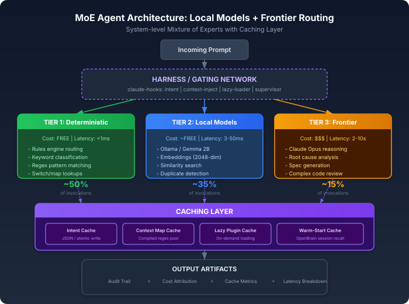

# Stop Sending Every Token to Your Most Expensive Model

## Post Blurb (Feed Teaser)

Stop sending every token to your most expensive model.

I watch teams burn $50/day on frontier API calls that a 2B-parameter local model could handle in 3ms for free. Classification, routing, embeddings, intent verification -- none of this requires GPT-4 or Claude Opus. It requires the right architecture.

I built a Mixture of Experts system where local agents handle the fast, deterministic work and a frontier model only activates for genuine reasoning. Here is the architecture, the caching layer that makes it fly, and the artifacts you should expect from a production MoE agent system.

---

## The $50/Day Mistake

There is a pattern I see in almost every AI-augmented engineering team: they route everything through a single frontier model. Every classification. Every embedding. Every routing decision. Every "is this prompt well-formed?" check. All of it goes to Claude Opus or GPT-4 at full token price and full latency.

The economics are brutal. A single frontier API call for classification costs 10-50x more than a local model doing the same job, and takes 800ms instead of 3ms. Multiply that by the dozens of micro-decisions an agent system makes per task -- routing, classification, embedding, validation, deduplication -- and you are burning money on work that does not require intelligence. It requires pattern matching.

This is not a theoretical problem. I have been building multi-agent systems for over a year, and the single biggest performance and cost improvement came from one architectural decision: stop treating every decision as a reasoning task.

---

## Mixture of Experts -- But Not the Way You Think

When most engineers hear "Mixture of Experts," they think of the internal architecture of models like Mixtral, where a gating network routes tokens to specialized sub-networks within a single model. That is interesting, but it is not what I mean.

I mean a system-level MoE: multiple independent models with different capabilities, costs, and latencies, orchestrated by a routing layer that sends each task to the cheapest model that can handle it correctly.

The topology looks like this:

There are three tiers:

**Tier 1 -- Deterministic Rules (zero cost, sub-millisecond).** Before any model touches a request, deterministic classifiers handle what they can. In my alert investigation system, rayne, a rules engine examines monitor type, tags, and service name to route alerts to the correct specialist -- infrastructure, application, database, network. No LLM. No API call. A switch statement and a map. This handles 100% of routing decisions with perfect accuracy because the classification taxonomy is known and finite.

**Tier 2 -- Local Models (near-zero cost, single-digit milliseconds).** For tasks that need semantic understanding but not complex reasoning -- embeddings, similarity search, short-text classification, intent parsing -- local models running via Ollama handle the work. In rayne, Gemma 2B generates 2048-dimensional embeddings of incident reports for vector similarity search in Qdrant. The embeddings power semantic recall: when a new alert fires, the system finds the five most similar past incidents in 12ms, entirely on-device, with zero API calls and zero data leaving the cluster.

In my memory system, OpenBrain, the same pattern applies. Every memory entry gets a 384-dimensional embedding via all-MiniLM-L6-v2 running locally. Duplicate detection, semantic search, and temporal relevance scoring all happen without touching a frontier API.

**Tier 3 -- Frontier Model (full cost, high latency, used sparingly).** Claude Opus activates only when the task genuinely requires multi-step reasoning, nuanced analysis, or creative generation. Root cause analysis of a complex infrastructure incident. Writing a technical specification. Reviewing code for architectural patterns. These are reasoning tasks that justify the cost and latency of a frontier call.

The key insight: in my production systems, Tier 3 accounts for less than 15% of total model invocations. The other 85% is handled by deterministic rules and local models.

---

## The Caching Layer That Makes It Fly

Even with the right model routing, you are still making redundant calls unless you cache aggressively. Caching in an MoE agent system is not just HTTP response caching -- it is structural.

**Intent Classification Cache.** My Claude Code harness includes an intent verification pipeline written in Go that parses prompt objectives, classifies them against predicate types (negation_check, count_check, structural_check, ast_check, semantic_check), and scores alignment against organizational objectives. Every classification result gets atomically written to `~/.claude/intent-tests/pending/{sessionID}.json` using temp-file-plus-rename for crash safety. On the next prompt, the system checks whether the same objective patterns have been classified before. Cache hit means zero LLM calls for intent verification.

**Context Map Cache.** The context-inject hook loads `context_map.json` files from a structured directory tree, each defining subcategories with keywords, regex patterns, and priority scores. Regex patterns are compiled once and cached in a `sync.Mutex`-protected map for the process lifetime. A prompt that triggers the "datadog APM" context on its first occurrence loads the same cached patterns in microseconds on subsequent prompts within the same session.

**Plugin Lazy-Loading Cache.** My lazy-component-loader maintains a registry of 15+ plugins and 12+ agents, each with keyword and regex trigger patterns. Instead of loading all plugin contexts (thousands of tokens) into every session, the loader scores incoming prompts against trigger patterns and injects only the matching plugin's context. The registry itself is cached as a parsed JSON structure, and pattern compilation is memoized. A session that never mentions "terraform" never loads the 3,000-token Terraform agent context.

**Warm-Start Cache.** On session start, the context-inject system queries OpenBrain for the last session summary, pending tasks, and relevant observations for the current project. This "warm start" data is fetched once per session (keyed by parent PID) and injected as an XML directive. The marker file at `/tmp/claude-warm-start-{ppid}` ensures the expensive MCP round-trip happens exactly once, not on every prompt.

These caches compound. A typical 20-prompt session hits the frontier model for maybe 4-5 genuine reasoning tasks. The other 15 prompts are routed, classified, and context-injected using cached local computation.

---

## The Harness: Building Your Own Routing Layer

Tools like Pi (pi.dev) have emerged to address exactly this problem. Pi is an open-source terminal coding harness that treats model routing as a first-class concern -- you can switch between Anthropic, OpenAI, Google, and local Ollama models mid-session, and define team configurations where lightweight models handle research while frontier models handle reasoning. The harness philosophy -- minimal core, maximum extensibility via lifecycle hooks -- mirrors what I built for Claude Code, but as a standalone tool rather than a wrapper.

My harness takes a different approach: it wraps Claude Code with a Go binary pipeline that intercepts every prompt and response through lifecycle hooks. The `claude-hooks` binary handles ~45 hook events across prompt submission, tool usage, and session lifecycle. Each hook is a focused Go package: `intent` for objective verification, `contextinject` for routing, `lazy` for on-demand plugin loading, `compact` for context compression, `supervisor` for delegation enforcement.

The critical architectural decision is that the harness is the MoE gating network. It decides what context gets injected, which plugins activate, whether the intent gate passes or blocks, and what cached data flows into the frontier model's context window. The frontier model never sees the routing logic -- it just receives a curated, pre-classified, pre-cached context package and does what it does best: reason.

---

## Expected Artifacts from a Production MoE System

If you are building an MoE agent architecture, here is what your system should produce:

**1. Classification Audit Trail.** Every routing decision -- which tier handled the request, what the confidence score was, why the decision was made -- should be logged. My intent system writes structured JSON with predicate types, alignment scores, and remediation suggestions for every prompt.

**2. Cost Attribution by Tier.** You should know exactly how much each tier costs per session, per day, per project. If Tier 3 is handling more than 20% of invocations, your routing is too conservative.

**3. Cache Hit Metrics.** Track cache hit rates for intent classification, context maps, plugin loading, and warm-start data. In a mature system, cache hit rates above 70% per session are typical.

**4. Latency Breakdown.** Each tier should have its own latency budget. Tier 1 under 1ms. Tier 2 under 50ms. Tier 3 under 10 seconds. If your local embeddings are taking 200ms, something is wrong with your model serving.

**5. Context Window Utilization.** The frontier model has a finite context window. Your MoE system should track how many tokens are injected via cached context vs. how many are available for actual reasoning. My lazy-loader saves ~5,000 tokens per session by not loading irrelevant plugin contexts.

**6. Escalation Paths.** When a lower tier cannot handle a request (low confidence classification, embedding similarity below threshold), there should be a clear escalation to the next tier with the original context preserved.

---

## The Uncomfortable Truth

The AI industry has a financial incentive to keep you routing everything through frontier APIs. Every token through Claude Opus or GPT-4 is revenue. Nobody is going to tell you that a 2B-parameter model running on your laptop can handle 85% of the classification, routing, and embedding work that your agent system needs.

But the math is clear. A system that sends every micro-decision to a frontier model is not just expensive -- it is slow. The 800ms round-trip for a classification call that a local model handles in 3ms is latency your users feel on every interaction.

Build the routing layer. Cache aggressively. Use local models for local problems. Reserve the frontier for what it was built for: thinking.

Your agents will be faster, cheaper, and -- counterintuitively -- smarter, because the frontier model receives clean, pre-classified, deduplicated context instead of raw, unrouted noise.

---

*Building multi-agent systems with MoE routing, persistent memory, and autonomous task execution. Opinions are my own.*
