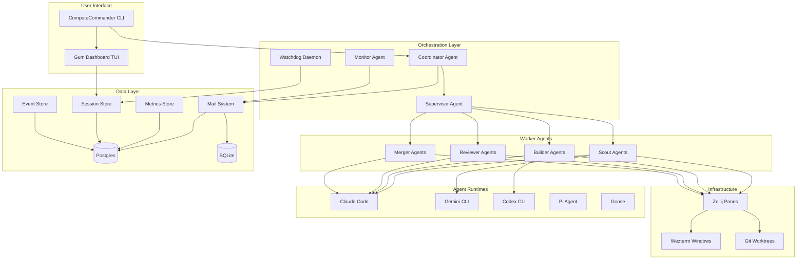
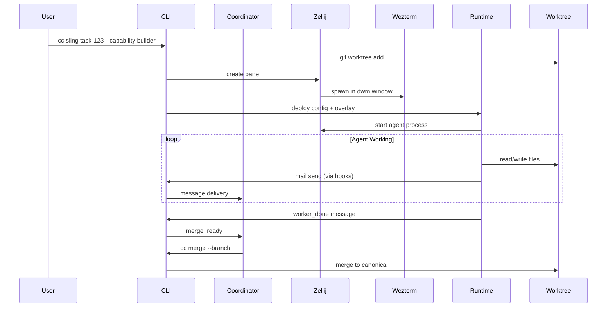
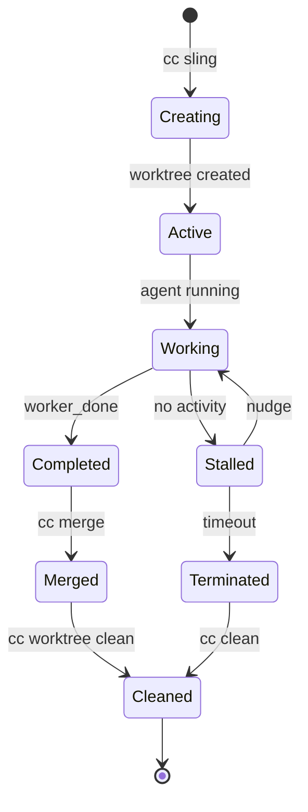
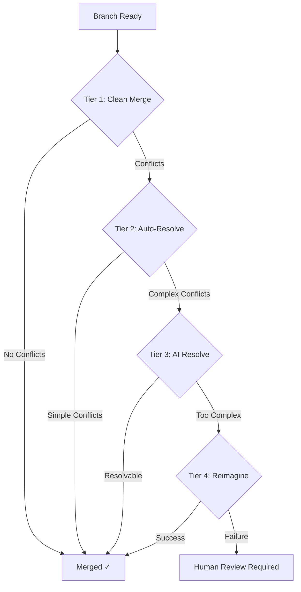
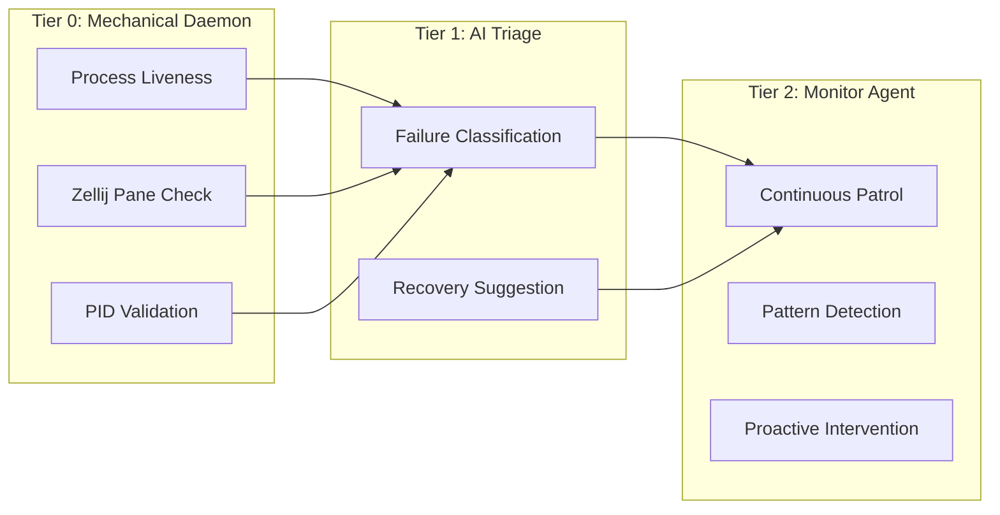
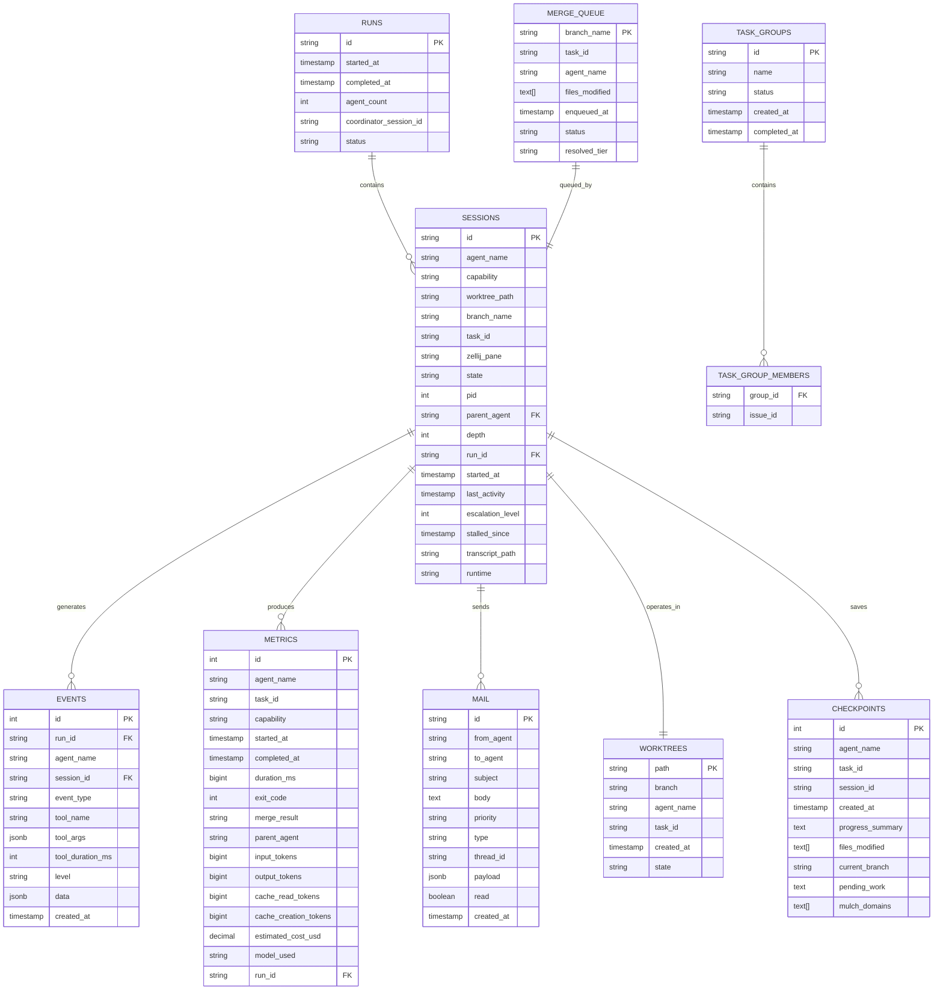
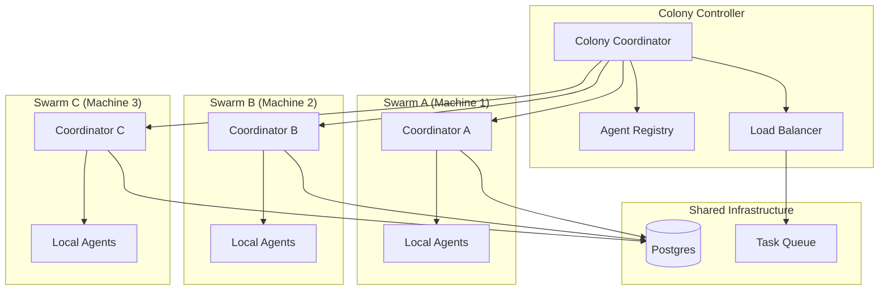

# ComputeCommander Specification

**Version:** 1.0.0-draft  
**Date:** 2026-02-26  
**Status:** Technical Specification

---

## Table of Contents

1. [Executive Summary](#1-executive-summary)
2. [Architecture Overview](#2-architecture-overview)
3. [Component Specifications](#3-component-specifications)
4. [Data Models](#4-data-models)
5. [API/CLI Reference](#5-apicli-reference)
6. [Configuration Reference](#6-configuration-reference)
7. [Agent Runtime Interface](#7-agent-runtime-interface)
8. [Migration Path](#8-migration-path)
9. [Future Roadmap](#9-future-roadmap)
10. [Appendices](#appendices)

---

## 1. Executive Summary

### 1.1 What is ComputeCommander?

ComputeCommander is a ground-up rebuild of [Overstory](https://github.com/jayminwest/overstory) — a multi-agent orchestration system for AI coding agents. It transforms a single coding session into a coordinated team of AI agents, each working in isolated git worktrees, communicating through a structured messaging system, and merging their work back with intelligent conflict resolution.

### 1.2 Why ComputeCommander?

While Overstory established the architectural foundations for agent swarm orchestration, ComputeCommander addresses key limitations:

| Limitation | Overstory | ComputeCommander |
|------------|-----------|------------------|
| **Language/Runtime** | TypeScript (Bun) - slower, requires runtime | Golang - compiled, single binary |
| **Database** | SQLite only - single machine | Postgres (primary) + SQLite (fallback) - distributed ready |
| **Terminal Multiplexer** | tmux - functional but dated | Zellij - modern, pane-aware, better UX |
| **TUI Framework** | Raw ANSI | Gum (charmbracelet) - polished, accessible |
| **Distribution** | npm link | Single static binary - zero dependencies |
| **Agent Runtimes** | Claude Code, Pi | Claude, Gemini, Codex, Pi, Goose |
| **Config Format** | JSON | YAML - more readable, comments supported |

### 1.3 Core Principles

1. **Isolation by Default**: Every agent operates in its own git worktree — no shared state, no file conflicts
2. **Explicit Communication**: Agents coordinate through typed messages, not implicit side effects
3. **Graceful Degradation**: SQLite fallback ensures single-machine operation without Postgres
4. **Observable Everything**: Every agent action is logged, traceable, and auditable
5. **Modular Runtimes**: Pluggable agent runtime interface supports any AI coding CLI
6. **Defense in Depth**: Tiered watchdog, tool enforcement, and hierarchy limits prevent runaway agents

### 1.4 Risk Acknowledgment

> **Warning**: Agent swarms are not a universal solution. Deploying ComputeCommander without understanding multi-agent orchestration risks — compounding error rates, cost amplification, debugging complexity, and merge conflicts — will result in worse outcomes than single-agent workflows.

See [Appendix A: Steelman Arguments](#appendix-a-steelman-arguments) for detailed risk analysis.

---

## 2. Architecture Overview

### 2.1 System Architecture Diagram



### 2.2 Execution Model



### 2.3 Agent Hierarchy

```
Coordinator (persistent orchestrator at project root, depth 0)
  └── Supervisor (per-project team lead, depth 1) [DEPRECATED - use leads]
  └── Lead (team coordination, can spawn sub-workers, depth 1)
        └── Scout (read-only exploration, depth 2)
        └── Builder (implementation, depth 2)
        └── Reviewer (validation, depth 2)
        └── Merger (branch merge specialist, depth 2)
  └── Monitor (Tier 2 continuous fleet patrol, no worktree, depth 0)
```

### 2.4 Agent Capabilities Matrix

| Agent | Role | Access | Can Spawn | Depth |
|-------|------|--------|-----------|-------|
| **Coordinator** | Persistent orchestrator — decomposes objectives, dispatches agents | Read-only | Yes (leads only) | 0 |
| **Supervisor** | Per-project team lead — manages worker lifecycle [DEPRECATED] | Read-only | Yes | 1 |
| **Lead** | Team coordination, owns a task subtree | Read-write | Yes | 1 |
| **Scout** | Read-only exploration and research | Read-only | No | 2 |
| **Builder** | Implementation and code changes | Read-write | No | 2 |
| **Reviewer** | Validation and code review | Read-only | No | 2 |
| **Merger** | Branch merge specialist | Read-write | No | 2 |
| **Monitor** | Tier 2 continuous fleet patrol | Read-only | No | 0 |

---

## 3. Component Specifications

### 3.1 Agent Spawning System

#### 3.1.1 Spawning Model

Agents spawn in **Zellij panes** within **Wezterm** windows managed by dwm. Each spawn:

1. Creates an isolated git worktree with a unique branch
2. Deploys runtime-specific configuration (overlay + hooks)
3. Launches a Zellij pane in a new or existing Wezterm window
4. Registers the session in the database
5. Sends the initial prompt via the runtime's mechanism

```go
// internal/agents/spawn.go
type SpawnRequest struct {
    TaskID      string
    Capability  Capability
    Name        string
    Runtime     RuntimeID
    Parent      string // empty for coordinator-spawned
    Depth       int
    FileScope   []string
    SpecPath    string
    SkipScout   bool
    SkipReview  bool
    MaxAgents   int
}

type SpawnResult struct {
    Session     *AgentSession
    WorktreePath string
    ZellijPane  string
    PID         int
}
```

#### 3.1.2 Zellij Integration

```go
// internal/zellij/pane.go
type PaneManager interface {
    CreatePane(opts CreatePaneOpts) (*Pane, error)
    ListPanes() ([]*Pane, error)
    SendKeys(paneID string, keys string) error
    CapturePaneContent(paneID string, lines int) (string, error)
    ClosePane(paneID string) error
}

type CreatePaneOpts struct {
    Layout      string // "default", "vertical", "horizontal"
    WorkDir     string
    Command     []string
    Name        string
    Floating    bool
}
```

#### 3.1.3 Wezterm Window Management

For dwm integration, ComputeCommander spawns Wezterm windows that dwm will manage as regular X11 windows:

```go
// internal/wezterm/window.go
type WindowManager interface {
    SpawnWindow(opts SpawnWindowOpts) error
    FocusWindow(sessionName string) error
    ListWindows() ([]*Window, error)
}

type SpawnWindowOpts struct {
    ZellijSession string
    Title         string
    WorkDir       string
}
```

### 3.2 Mail System

#### 3.2.1 Overview

The mail system is the backbone of agent coordination. It provides:
- Typed protocol messages for structured coordination
- Broadcast addresses for group messaging
- Thread support for conversations
- Priority levels for message ordering
- Debounced polling to prevent token waste

#### 3.2.2 Message Types

**Semantic Types** (human-readable status):
- `status` — Progress update
- `question` — Needs input
- `result` — Work output
- `error` — Problem report

**Protocol Types** (structured coordination):
- `worker_done` — Task completion signal
- `merge_ready` — Branch verified, ready to merge
- `merged` — Merge succeeded
- `merge_failed` — Merge failed, needs rework
- `escalation` — Problem escalated to supervisor
- `health_check` — Watchdog liveness probe
- `dispatch` — Coordinator sends work to supervisor
- `assign` — Supervisor assigns work to worker

#### 3.2.3 Broadcast Addresses

| Address | Recipients |
|---------|------------|
| `@all` | All active agents |
| `@builders` | All builder agents |
| `@scouts` | All scout agents |
| `@reviewers` | All reviewer agents |
| `@leads` | All lead/supervisor agents |
| `@workers` | All non-coordinator agents |

#### 3.2.4 Mail Store Interface

```go
// internal/mail/store.go
type MailStore interface {
    Send(msg *MailMessage) error
    Check(agent string, opts CheckOpts) ([]*MailMessage, error)
    List(opts ListOpts) ([]*MailMessage, error)
    MarkRead(id string) error
    Reply(id string, body string) error
    Purge(opts PurgeOpts) (int, error)
}

type MailMessage struct {
    ID        string         `json:"id" db:"id"`
    From      string         `json:"from" db:"from_agent"`
    To        string         `json:"to" db:"to_agent"`
    Subject   string         `json:"subject" db:"subject"`
    Body      string         `json:"body" db:"body"`
    Priority  Priority       `json:"priority" db:"priority"`
    Type      MessageType    `json:"type" db:"type"`
    ThreadID  *string        `json:"threadId" db:"thread_id"`
    Payload   json.RawMessage `json:"payload" db:"payload"`
    Read      bool           `json:"read" db:"read"`
    CreatedAt time.Time      `json:"createdAt" db:"created_at"`
}
```

### 3.3 Worktree Management

#### 3.3.1 Worktree Lifecycle



#### 3.3.2 Worktree Manager

```go
// internal/worktree/manager.go
type WorktreeManager interface {
    Create(opts CreateOpts) (*Worktree, error)
    List() ([]*Worktree, error)
    Status(path string) (*WorktreeStatus, error)
    Clean(opts CleanOpts) (int, error)
    Remove(path string, force bool) error
}

type Worktree struct {
    Path       string
    Branch     string
    Agent      string
    TaskID     string
    CreatedAt  time.Time
    State      WorktreeState
}

type WorktreeState string
const (
    WorktreeActive    WorktreeState = "active"
    WorktreeCompleted WorktreeState = "completed"
    WorktreeMerged    WorktreeState = "merged"
    WorktreeOrphaned  WorktreeState = "orphaned"
)
```

### 3.4 Merge System

#### 3.4.1 FIFO Merge Queue

The merge queue processes branches in order of completion, with 4-tier conflict resolution:



#### 3.4.2 Resolution Tiers

| Tier | Name | Strategy | When Used |
|------|------|----------|-----------|
| 1 | Clean Merge | `git merge --no-edit` | No conflicts |
| 2 | Auto-Resolve | Git merge strategies | Trivial conflicts (whitespace, imports) |
| 3 | AI Resolve | LLM-assisted merge | Semantic conflicts in same files |
| 4 | Reimagine | Agent re-implements | Fundamentally incompatible changes |

#### 3.4.3 Merge Queue Interface

```go
// internal/merge/queue.go
type MergeQueue interface {
    Enqueue(entry *MergeEntry) error
    Dequeue() (*MergeEntry, error)
    Peek() (*MergeEntry, error)
    Status(branch string) (*MergeEntry, error)
    List(opts ListOpts) ([]*MergeEntry, error)
}

type MergeEntry struct {
    BranchName     string       `db:"branch_name"`
    TaskID         string       `db:"task_id"`
    AgentName      string       `db:"agent_name"`
    FilesModified  []string     `db:"files_modified"`
    EnqueuedAt     time.Time    `db:"enqueued_at"`
    Status         MergeStatus  `db:"status"`
    ResolvedTier   *ResolutionTier `db:"resolved_tier"`
}

type MergeStatus string
const (
    MergePending  MergeStatus = "pending"
    MergeMerging  MergeStatus = "merging"
    MergeMerged   MergeStatus = "merged"
    MergeConflict MergeStatus = "conflict"
    MergeFailed   MergeStatus = "failed"
)
```

### 3.5 Watchdog System

#### 3.5.1 Tiered Health Monitoring



#### 3.5.2 Smart Nudge System

The nudge system intelligently handles stalled agents:

**Soft Nudge:**
- Sends a message to the agent's Zellij pane
- Asks for status update
- Resets activity timer
- No process interruption

**Hard Nudge:**
- Kills the agent process
- Respawns in the same worktree
- Preserves checkpoint state
- Continues from last known progress

**Context-Aware Detection:**
```go
// internal/watchdog/nudge.go
type NudgeDecision struct {
    Agent           string
    ShouldNudge     bool
    NudgeType       NudgeType // soft | hard
    Reason          string
    ContextSummary  string
    TimeOnTask      time.Duration
    EstimatedEffort time.Duration
}

func (w *Watchdog) EvaluateNudge(agent string) (*NudgeDecision, error) {
    // 1. Get recent context (last N tool calls, messages)
    // 2. Estimate task complexity from spec
    // 3. Compare actual time vs expected time
    // 4. Check for loop patterns (repeated tool failures)
    // 5. DO NOT assume loops - make intelligent determination
    // 6. Return decision with reasoning
}
```

#### 3.5.3 Nudge Configuration

```yaml
nudge:
  soft_timeout: 10m      # Time before soft nudge
  hard_timeout: 30m      # Time before hard nudge (after soft)
  escalation_enabled: true
  context_window: 50     # Messages/events to analyze
  loop_detection:
    enabled: true
    window: 5m
    threshold: 3         # Repeated failures before flagging
```

### 3.6 Token Instrumentation

#### 3.6.1 Metrics Collection

```go
// internal/metrics/store.go
type MetricsStore interface {
    RecordSession(m *SessionMetrics) error
    RecordSnapshot(s *TokenSnapshot) error
    GetSessionMetrics(opts QueryOpts) ([]*SessionMetrics, error)
    GetCostBreakdown(opts CostOpts) (*CostBreakdown, error)
    GetRunMetrics(runID string) (*RunMetrics, error)
}

type SessionMetrics struct {
    AgentName          string
    TaskID             string
    Capability         Capability
    StartedAt          time.Time
    CompletedAt        *time.Time
    DurationMs         int64
    InputTokens        int64
    OutputTokens       int64
    CacheReadTokens    int64
    CacheCreationTokens int64
    EstimatedCostUSD   *float64
    ModelUsed          string
    RunID              string
}

type CostBreakdown struct {
    TotalCost      float64
    ByCapability   map[Capability]float64
    ByModel        map[string]float64
    ByAgent        map[string]float64
    TokensIn       int64
    TokensOut      int64
    CacheHitRate   float64
}
```

#### 3.6.2 Runtime-Specific Transcript Parsing

Each runtime adapter implements transcript parsing:

```go
// pkg/runtimes/interface.go
type TranscriptSummary struct {
    InputTokens  int64
    OutputTokens int64
    Model        string
}

// Each runtime implements ParseTranscript
func (r *ClaudeRuntime) ParseTranscript(path string) (*TranscriptSummary, error)
func (r *GeminiRuntime) ParseTranscript(path string) (*TranscriptSummary, error)
// etc.
```

### 3.7 Tool Enforcement

#### 3.7.1 Guard System

Agents are restricted based on their capability:

| Capability | File Write | Git Push | Git Force | Spawn |
|------------|------------|----------|-----------|-------|
| Scout | ✗ | ✗ | ✗ | ✗ |
| Builder | ✓ (scoped) | ✗ | ✗ | ✗ |
| Reviewer | ✗ | ✗ | ✗ | ✗ |
| Lead | ✓ | ✗ | ✗ | ✓ |
| Merger | ✓ | ✗ | ✗ | ✗ |
| Coordinator | ✗ | ✗ | ✗ | ✓ |

#### 3.7.2 Guard Rules Configuration

```yaml
# .computecommander/hooks/rules.yaml
guards:
  global:
    blocked_commands:
      - "git push --force"
      - "git reset --hard"
      - "rm -rf /"
    blocked_paths:
      - ".git/"
      - ".computecommander/"
      
  by_capability:
    scout:
      read_only: true
      allowed_tools:
        - Read
        - Glob
        - Grep
        - Bash  # read-only commands only
        
    builder:
      file_scope_enforced: true
      blocked_tools:
        - Spawn
      allowed_git:
        - add
        - commit
        - status
        - diff
        
    reviewer:
      read_only: true
      allowed_tools:
        - Read
        - Glob
        - Grep
        - Bash
```

### 3.8 Dashboard TUI

#### 3.8.1 Gum-Powered Interface

The dashboard uses [charmbracelet/gum](https://github.com/charmbracelet/gum) for a polished TUI:

```
╭─────────────────────────────────────────────────────────────────╮
│ ComputeCommander Dashboard          Run: run-2026-02-26T15:30  │
├─────────────────────────────────────────────────────────────────┤
│ Agents (5 active)                                               │
│ ┌─────────┬───────────┬─────────┬──────────┬─────────┬────────┐│
│ │ Name    │ Capability│ State   │ Task     │ Runtime │ Tokens ││
│ ├─────────┼───────────┼─────────┼──────────┼─────────┼────────┤│
│ │ scout-1 │ scout     │ working │ task-123 │ gemini  │ 12.5k  ││
│ │ build-1 │ builder   │ working │ task-124 │ claude  │ 45.2k  ││
│ │ build-2 │ builder   │ stalled │ task-125 │ claude  │ 23.1k  ││
│ │ review-1│ reviewer  │ working │ task-126 │ claude  │ 8.7k   ││
│ │ lead-1  │ lead      │ idle    │ task-127 │ claude  │ 67.3k  ││
│ └─────────┴───────────┴─────────┴──────────┴─────────┴────────┘│
├─────────────────────────────────────────────────────────────────┤
│ Mail: 3 unread │ Merge Queue: 2 pending │ Cost: $4.23          │
├─────────────────────────────────────────────────────────────────┤
│ [s]tatus [m]ail [n]udge [i]nspect [c]osts [q]uit              │
╰─────────────────────────────────────────────────────────────────╯
```

#### 3.8.2 Dashboard Components

```go
// internal/tui/dashboard.go
type Dashboard struct {
    agents    *AgentTable
    mail      *MailSummary
    queue     *MergeQueueView
    costs     *CostTracker
    interval  time.Duration
}

func (d *Dashboard) Run(ctx context.Context) error
func (d *Dashboard) Refresh() error
```

---

## 4. Data Models

### 4.1 Database Architecture



### 4.2 Postgres Schema

```sql
-- Enable required extensions
CREATE EXTENSION IF NOT EXISTS "uuid-ossp";

-- Runs table
CREATE TABLE runs (
    id VARCHAR(64) PRIMARY KEY,
    started_at TIMESTAMPTZ NOT NULL DEFAULT NOW(),
    completed_at TIMESTAMPTZ,
    agent_count INT NOT NULL DEFAULT 0,
    coordinator_session_id VARCHAR(64),
    status VARCHAR(20) NOT NULL DEFAULT 'active'
        CHECK (status IN ('active', 'completed', 'failed'))
);

CREATE INDEX idx_runs_status ON runs(status);
CREATE INDEX idx_runs_started_at ON runs(started_at DESC);

-- Sessions table
CREATE TABLE sessions (
    id VARCHAR(64) PRIMARY KEY,
    agent_name VARCHAR(128) NOT NULL,
    capability VARCHAR(32) NOT NULL
        CHECK (capability IN ('scout', 'builder', 'reviewer', 'lead', 'merger', 'coordinator', 'supervisor', 'monitor')),
    worktree_path TEXT,
    branch_name VARCHAR(256),
    task_id VARCHAR(128) NOT NULL,
    zellij_pane VARCHAR(64),
    state VARCHAR(20) NOT NULL DEFAULT 'booting'
        CHECK (state IN ('booting', 'working', 'completed', 'stalled', 'zombie')),
    pid INT,
    parent_agent VARCHAR(128),
    depth INT NOT NULL DEFAULT 0,
    run_id VARCHAR(64) REFERENCES runs(id),
    started_at TIMESTAMPTZ NOT NULL DEFAULT NOW(),
    last_activity TIMESTAMPTZ NOT NULL DEFAULT NOW(),
    escalation_level INT NOT NULL DEFAULT 0,
    stalled_since TIMESTAMPTZ,
    transcript_path TEXT,
    runtime VARCHAR(32) NOT NULL DEFAULT 'claude'
);

CREATE INDEX idx_sessions_run_id ON sessions(run_id);
CREATE INDEX idx_sessions_state ON sessions(state);
CREATE INDEX idx_sessions_agent_name ON sessions(agent_name);
CREATE INDEX idx_sessions_capability ON sessions(capability);

-- Events table
CREATE TABLE events (
    id BIGSERIAL PRIMARY KEY,
    run_id VARCHAR(64) REFERENCES runs(id),
    agent_name VARCHAR(128) NOT NULL,
    session_id VARCHAR(64) REFERENCES sessions(id),
    event_type VARCHAR(32) NOT NULL
        CHECK (event_type IN ('tool_start', 'tool_end', 'session_start', 'session_end', 
                              'mail_sent', 'mail_received', 'spawn', 'error', 'custom')),
    tool_name VARCHAR(64),
    tool_args JSONB,
    tool_duration_ms INT,
    level VARCHAR(10) NOT NULL DEFAULT 'info'
        CHECK (level IN ('debug', 'info', 'warn', 'error')),
    data JSONB,
    created_at TIMESTAMPTZ NOT NULL DEFAULT NOW()
);

CREATE INDEX idx_events_run_id ON events(run_id);
CREATE INDEX idx_events_agent_name ON events(agent_name);
CREATE INDEX idx_events_event_type ON events(event_type);
CREATE INDEX idx_events_created_at ON events(created_at DESC);
CREATE INDEX idx_events_level ON events(level) WHERE level IN ('warn', 'error');

-- Mail table
CREATE TABLE mail (
    id VARCHAR(32) PRIMARY KEY,
    from_agent VARCHAR(128) NOT NULL,
    to_agent VARCHAR(128) NOT NULL,
    subject VARCHAR(256) NOT NULL,
    body TEXT NOT NULL,
    priority VARCHAR(10) NOT NULL DEFAULT 'normal'
        CHECK (priority IN ('low', 'normal', 'high', 'urgent')),
    type VARCHAR(20) NOT NULL
        CHECK (type IN ('status', 'question', 'result', 'error',
                       'worker_done', 'merge_ready', 'merged', 'merge_failed',
                       'escalation', 'health_check', 'dispatch', 'assign')),
    thread_id VARCHAR(32),
    payload JSONB,
    read BOOLEAN NOT NULL DEFAULT FALSE,
    created_at TIMESTAMPTZ NOT NULL DEFAULT NOW()
);

CREATE INDEX idx_mail_to_agent ON mail(to_agent);
CREATE INDEX idx_mail_read ON mail(read) WHERE read = FALSE;
CREATE INDEX idx_mail_created_at ON mail(created_at DESC);
CREATE INDEX idx_mail_thread_id ON mail(thread_id) WHERE thread_id IS NOT NULL;

-- Metrics table
CREATE TABLE metrics (
    id BIGSERIAL PRIMARY KEY,
    agent_name VARCHAR(128) NOT NULL,
    task_id VARCHAR(128) NOT NULL,
    capability VARCHAR(32) NOT NULL,
    started_at TIMESTAMPTZ NOT NULL,
    completed_at TIMESTAMPTZ,
    duration_ms BIGINT,
    exit_code INT,
    merge_result VARCHAR(20),
    parent_agent VARCHAR(128),
    input_tokens BIGINT NOT NULL DEFAULT 0,
    output_tokens BIGINT NOT NULL DEFAULT 0,
    cache_read_tokens BIGINT NOT NULL DEFAULT 0,
    cache_creation_tokens BIGINT NOT NULL DEFAULT 0,
    estimated_cost_usd DECIMAL(10, 4),
    model_used VARCHAR(64),
    run_id VARCHAR(64) REFERENCES runs(id)
);

CREATE INDEX idx_metrics_run_id ON metrics(run_id);
CREATE INDEX idx_metrics_agent_name ON metrics(agent_name);
CREATE INDEX idx_metrics_capability ON metrics(capability);

-- Merge queue table
CREATE TABLE merge_queue (
    branch_name VARCHAR(256) PRIMARY KEY,
    task_id VARCHAR(128) NOT NULL,
    agent_name VARCHAR(128) NOT NULL,
    files_modified TEXT[] NOT NULL DEFAULT '{}',
    enqueued_at TIMESTAMPTZ NOT NULL DEFAULT NOW(),
    status VARCHAR(20) NOT NULL DEFAULT 'pending'
        CHECK (status IN ('pending', 'merging', 'merged', 'conflict', 'failed')),
    resolved_tier VARCHAR(20)
        CHECK (resolved_tier IN ('clean-merge', 'auto-resolve', 'ai-resolve', 'reimagine'))
);

CREATE INDEX idx_merge_queue_status ON merge_queue(status);
CREATE INDEX idx_merge_queue_enqueued_at ON merge_queue(enqueued_at);

-- Task groups
CREATE TABLE task_groups (
    id VARCHAR(32) PRIMARY KEY,
    name VARCHAR(256) NOT NULL,
    status VARCHAR(20) NOT NULL DEFAULT 'active'
        CHECK (status IN ('active', 'completed')),
    created_at TIMESTAMPTZ NOT NULL DEFAULT NOW(),
    completed_at TIMESTAMPTZ
);

CREATE TABLE task_group_members (
    group_id VARCHAR(32) REFERENCES task_groups(id) ON DELETE CASCADE,
    issue_id VARCHAR(128) NOT NULL,
    PRIMARY KEY (group_id, issue_id)
);

-- Checkpoints for session recovery
CREATE TABLE checkpoints (
    id BIGSERIAL PRIMARY KEY,
    agent_name VARCHAR(128) NOT NULL,
    task_id VARCHAR(128) NOT NULL,
    session_id VARCHAR(64) REFERENCES sessions(id),
    created_at TIMESTAMPTZ NOT NULL DEFAULT NOW(),
    progress_summary TEXT NOT NULL,
    files_modified TEXT[] NOT NULL DEFAULT '{}',
    current_branch VARCHAR(256) NOT NULL,
    pending_work TEXT NOT NULL,
    mulch_domains TEXT[] NOT NULL DEFAULT '{}'
);

CREATE INDEX idx_checkpoints_agent_name ON checkpoints(agent_name);
CREATE INDEX idx_checkpoints_created_at ON checkpoints(created_at DESC);
```

### 4.3 SQLite Schema (Fallback)

The SQLite schema mirrors Postgres with SQLite-compatible types:

```sql
-- SQLite pragmas
PRAGMA journal_mode = WAL;
PRAGMA busy_timeout = 5000;
PRAGMA foreign_keys = ON;

-- Runs table
CREATE TABLE IF NOT EXISTS runs (
    id TEXT PRIMARY KEY,
    started_at TEXT NOT NULL DEFAULT (datetime('now')),
    completed_at TEXT,
    agent_count INTEGER NOT NULL DEFAULT 0,
    coordinator_session_id TEXT,
    status TEXT NOT NULL DEFAULT 'active'
        CHECK (status IN ('active', 'completed', 'failed'))
);

-- Sessions table
CREATE TABLE IF NOT EXISTS sessions (
    id TEXT PRIMARY KEY,
    agent_name TEXT NOT NULL,
    capability TEXT NOT NULL
        CHECK (capability IN ('scout', 'builder', 'reviewer', 'lead', 'merger', 'coordinator', 'supervisor', 'monitor')),
    worktree_path TEXT,
    branch_name TEXT,
    task_id TEXT NOT NULL,
    zellij_pane TEXT,
    state TEXT NOT NULL DEFAULT 'booting'
        CHECK (state IN ('booting', 'working', 'completed', 'stalled', 'zombie')),
    pid INTEGER,
    parent_agent TEXT,
    depth INTEGER NOT NULL DEFAULT 0,
    run_id TEXT REFERENCES runs(id),
    started_at TEXT NOT NULL DEFAULT (datetime('now')),
    last_activity TEXT NOT NULL DEFAULT (datetime('now')),
    escalation_level INTEGER NOT NULL DEFAULT 0,
    stalled_since TEXT,
    transcript_path TEXT,
    runtime TEXT NOT NULL DEFAULT 'claude'
);

-- Events table (files_modified stored as JSON string)
CREATE TABLE IF NOT EXISTS events (
    id INTEGER PRIMARY KEY AUTOINCREMENT,
    run_id TEXT REFERENCES runs(id),
    agent_name TEXT NOT NULL,
    session_id TEXT REFERENCES sessions(id),
    event_type TEXT NOT NULL,
    tool_name TEXT,
    tool_args TEXT, -- JSON
    tool_duration_ms INTEGER,
    level TEXT NOT NULL DEFAULT 'info',
    data TEXT, -- JSON
    created_at TEXT NOT NULL DEFAULT (datetime('now'))
);

-- Mail table
CREATE TABLE IF NOT EXISTS mail (
    id TEXT PRIMARY KEY,
    from_agent TEXT NOT NULL,
    to_agent TEXT NOT NULL,
    subject TEXT NOT NULL,
    body TEXT NOT NULL,
    priority TEXT NOT NULL DEFAULT 'normal',
    type TEXT NOT NULL,
    thread_id TEXT,
    payload TEXT, -- JSON
    read INTEGER NOT NULL DEFAULT 0,
    created_at TEXT NOT NULL DEFAULT (datetime('now'))
);

-- Metrics table
CREATE TABLE IF NOT EXISTS metrics (
    id INTEGER PRIMARY KEY AUTOINCREMENT,
    agent_name TEXT NOT NULL,
    task_id TEXT NOT NULL,
    capability TEXT NOT NULL,
    started_at TEXT NOT NULL,
    completed_at TEXT,
    duration_ms INTEGER,
    exit_code INTEGER,
    merge_result TEXT,
    parent_agent TEXT,
    input_tokens INTEGER NOT NULL DEFAULT 0,
    output_tokens INTEGER NOT NULL DEFAULT 0,
    cache_read_tokens INTEGER NOT NULL DEFAULT 0,
    cache_creation_tokens INTEGER NOT NULL DEFAULT 0,
    estimated_cost_usd REAL,
    model_used TEXT,
    run_id TEXT REFERENCES runs(id)
);

-- Merge queue
CREATE TABLE IF NOT EXISTS merge_queue (
    branch_name TEXT PRIMARY KEY,
    task_id TEXT NOT NULL,
    agent_name TEXT NOT NULL,
    files_modified TEXT NOT NULL DEFAULT '[]', -- JSON array
    enqueued_at TEXT NOT NULL DEFAULT (datetime('now')),
    status TEXT NOT NULL DEFAULT 'pending',
    resolved_tier TEXT
);

-- Task groups
CREATE TABLE IF NOT EXISTS task_groups (
    id TEXT PRIMARY KEY,
    name TEXT NOT NULL,
    status TEXT NOT NULL DEFAULT 'active',
    created_at TEXT NOT NULL DEFAULT (datetime('now')),
    completed_at TEXT
);

CREATE TABLE IF NOT EXISTS task_group_members (
    group_id TEXT NOT NULL REFERENCES task_groups(id) ON DELETE CASCADE,
    issue_id TEXT NOT NULL,
    PRIMARY KEY (group_id, issue_id)
);

-- Checkpoints
CREATE TABLE IF NOT EXISTS checkpoints (
    id INTEGER PRIMARY KEY AUTOINCREMENT,
    agent_name TEXT NOT NULL,
    task_id TEXT NOT NULL,
    session_id TEXT REFERENCES sessions(id),
    created_at TEXT NOT NULL DEFAULT (datetime('now')),
    progress_summary TEXT NOT NULL,
    files_modified TEXT NOT NULL DEFAULT '[]', -- JSON array
    current_branch TEXT NOT NULL,
    pending_work TEXT NOT NULL,
    mulch_domains TEXT NOT NULL DEFAULT '[]' -- JSON array
);

-- Create all indexes
CREATE INDEX IF NOT EXISTS idx_sessions_run_id ON sessions(run_id);
CREATE INDEX IF NOT EXISTS idx_sessions_state ON sessions(state);
CREATE INDEX IF NOT EXISTS idx_events_run_id ON events(run_id);
CREATE INDEX IF NOT EXISTS idx_events_agent_name ON events(agent_name);
CREATE INDEX IF NOT EXISTS idx_mail_to_agent ON mail(to_agent);
CREATE INDEX IF NOT EXISTS idx_mail_read ON mail(read) WHERE read = 0;
CREATE INDEX IF NOT EXISTS idx_metrics_run_id ON metrics(run_id);
CREATE INDEX IF NOT EXISTS idx_merge_queue_status ON merge_queue(status);
```

---

## 5. API/CLI Reference

### 5.1 Command Overview

```
computecommander (cc) - Multi-agent orchestration for AI coding agents

USAGE:
    cc <command> [options]

CORE COMMANDS:
    init                    Initialize project
    sling <task-id>         Spawn worker agent
    stop <agent>            Terminate agent
    status                  Fleet status overview
    dashboard               Live TUI dashboard

COORDINATION:
    coordinator             Persistent orchestrator lifecycle
    supervisor              Per-project team lead [DEPRECATED]
    monitor                 Tier 2 monitor agent

MESSAGING:
    mail                    Inter-agent messaging
    nudge <agent>           Send nudge to agent

MERGE:
    merge                   Merge agent branches

GROUPS:
    group                   Task group batch tracking

OBSERVABILITY:
    inspect <agent>         Deep agent inspection
    trace                   Event timeline
    errors                  Aggregated error view
    replay                  Multi-agent replay
    feed                    Real-time event stream
    logs                    Query logs
    costs                   Token/cost analysis
    metrics                 Session metrics
    run                     Run management

INFRASTRUCTURE:
    worktree                Worktree management
    watch                   Watchdog daemon (Tier 0)
    doctor                  Health checks
    clean                   Cleanup resources
    config                  Configuration management
    feature                 Feature flag management

GLOBAL FLAGS:
    -q, --quiet             Suppress non-error output
    --json                  JSON output
    --timing                Show execution timing
    -h, --help              Show help
    -v, --version           Show version
```

### 5.2 Core Commands

#### `cc init`

Initialize ComputeCommander in a project.

```bash
cc init [options]

OPTIONS:
    -y, --yes               Skip interactive prompts
    --name <name>           Project name (default: directory name)
    --db <postgres|sqlite>  Database backend (default: auto-detect)
    --json                  JSON output

EXAMPLES:
    cc init
    cc init --yes --name my-project
    cc init --db sqlite
```

**Creates:**
```
.computecommander/
├── config.yaml
├── config.local.yaml      # gitignored
├── agents/                # User agent definitions
├── hooks/
│   └── rules.yaml
├── specs/
├── worktrees/             # gitignored
├── logs/                  # gitignored
└── *.db                   # gitignored (SQLite mode)
```

#### `cc sling <task-id>`

Spawn a worker agent.

```bash
cc sling <task-id> [options]

OPTIONS:
    --capability <type>     Agent type: scout|builder|reviewer|lead|merger (required)
    --name <name>           Unique agent name (required)
    --runtime <runtime>     Runtime: claude|gemini|codex|pi|goose (default: config)
    --spec <path>           Path to task spec file
    --files <f1,f2,...>     Exclusive file scope (comma-separated)
    --parent <agent>        Parent agent (for hierarchy tracking)
    --depth <n>             Current hierarchy depth (default: 0)
    --skip-scout            Skip scout phase (for leads)
    --skip-review           Skip review phase (for leads)
    --max-agents <n>        Max children per lead
    --json                  JSON output

EXAMPLES:
    cc sling task-123 --capability builder --name build-auth
    cc sling task-124 --capability scout --name scout-db --runtime gemini
    cc sling task-125 --capability lead --name lead-api --skip-scout
```

#### `cc stop <agent>`

Terminate a running agent.

```bash
cc stop <agent-name> [options]

OPTIONS:
    --clean-worktree        Remove the agent's worktree
    --force                 Force termination (SIGKILL)
    --json                  JSON output

EXAMPLES:
    cc stop build-auth
    cc stop scout-db --clean-worktree
```

#### `cc status`

Show fleet status.

```bash
cc status [options]

OPTIONS:
    --verbose, -v           Extra per-agent detail
    --all                   Show all runs (default: current run)
    --json                  JSON output

OUTPUT:
    Run: run-2026-02-26T15:30 (active)
    Agents: 5 active, 2 completed, 0 stalled
    
    NAME        CAPABILITY  STATE     TASK      RUNTIME  LAST ACTIVITY
    scout-1     scout       working   task-123  gemini   2m ago
    build-1     builder     working   task-124  claude   30s ago
    ...
```

#### `cc dashboard`

Live TUI dashboard for agent monitoring.

```bash
cc dashboard [options]

OPTIONS:
    --interval <ms>         Poll interval (default: 2000, min: 500)
    --all                   Show all runs

KEYBINDINGS:
    s                       Toggle status details
    m                       Show mail
    n                       Nudge selected agent
    i                       Inspect selected agent
    c                       Show costs
    j/k                     Navigate up/down
    q                       Quit
```

### 5.3 Coordination Commands

#### `cc coordinator`

Manage persistent coordinator agent.

```bash
cc coordinator <subcommand> [options]

SUBCOMMANDS:
    start                   Start coordinator
        --attach/--no-attach    Attach to Zellij pane (default: attach on TTY)
        --watchdog              Auto-start watchdog daemon
        --monitor               Auto-start Tier 2 monitor
    stop                    Stop coordinator
    status                  Show coordinator state

OPTIONS:
    --json                  JSON output

EXAMPLES:
    cc coordinator start --watchdog --monitor
    cc coordinator stop
    cc coordinator status --json
```

#### `cc monitor`

Manage Tier 2 monitor agent.

```bash
cc monitor <subcommand> [options]

SUBCOMMANDS:
    start                   Start monitor agent
    stop                    Stop monitor agent
    status                  Show monitor state

OPTIONS:
    --json                  JSON output
```

### 5.4 Messaging Commands

#### `cc mail`

Inter-agent messaging.

```bash
cc mail <subcommand> [options]

SUBCOMMANDS:
    send                    Send a message
        --from <name>           Sender name
        --to <agent>            Recipient (required)
        --subject <text>        Subject line (required)
        --body <text>           Message body (required)
        --type <type>           Message type
        --priority <p>          low|normal|high|urgent
        --payload <json>        Structured JSON payload
        
    check                   Check inbox (unread messages)
        --agent <name>          Agent name
        --inject                Format for agent injection
        --debounce <ms>         Skip if checked recently
        
    list                    List messages
        --from <name>           Filter by sender
        --to <name>             Filter by recipient
        --unread                Only unread messages
        --limit <n>             Max messages
        
    read <id>               Mark message as read
    
    reply <id>              Reply to message
        --body <text>           Reply body (required)
        
    purge                   Delete old messages
        --all                   Delete all
        --days <n>              Older than N days
        --agent <name>          For specific agent

OPTIONS:
    --json                  JSON output

EXAMPLES:
    cc mail send --to build-auth --subject "Review needed" --body "Please check..."
    cc mail check --agent scout-1 --inject
    cc mail list --unread --limit 10
```

#### `cc nudge <agent>`

Send a nudge to an agent.

```bash
cc nudge <agent> [message] [options]

OPTIONS:
    --soft                  Soft nudge (send message only, default)
    --hard                  Hard nudge (kill + respawn)
    --from <name>           Sender name
    --force                 Skip debounce check
    --json                  JSON output

EXAMPLES:
    cc nudge build-auth "How's progress?"
    cc nudge build-auth --hard
```

### 5.5 Merge Commands

#### `cc merge`

Merge agent branches into canonical.

```bash
cc merge [options]

OPTIONS:
    --branch <name>         Merge specific branch
    --all                   Merge all completed branches
    --into <branch>         Target branch (default: config canonical)
    --dry-run               Check for conflicts only
    --json                  JSON output

EXAMPLES:
    cc merge --branch agent/build-auth/task-123
    cc merge --all --dry-run
    cc merge --all --into develop
```

### 5.6 Task Group Commands

#### `cc group`

Batch coordination for related tasks.

```bash
cc group <subcommand> [options]

SUBCOMMANDS:
    create <name> <id>...   Create task group with initial issues
    status [group-id]       Show group progress
    add <group-id> <id>...  Add issues to group
    remove <group-id> <id>... Remove issues from group
    list                    List all groups

OPTIONS:
    --json                  JSON output

EXAMPLES:
    cc group create "auth-refactor" task-123 task-124 task-125
    cc group status auth-refactor
    cc group add auth-refactor task-126
```

### 5.7 Observability Commands

#### `cc inspect <agent>`

Deep inspection of a single agent.

```bash
cc inspect <agent> [options]

OPTIONS:
    --follow, -f            Poll and refresh continuously
    --interval <ms>         Polling interval (default: 3000)
    --limit <n>             Recent tool calls to show (default: 20)
    --no-zellij             Skip Zellij pane capture
    --json                  JSON output
```

#### `cc trace`

View agent/task timeline.

```bash
cc trace [target] [options]

OPTIONS:
    --agent <name>          Filter by agent
    --run <id>              Filter by run
    --since <ts>            Start time (ISO 8601)
    --until <ts>            End time (ISO 8601)
    --limit <n>             Max events (default: 100)
    --json                  JSON output
```

#### `cc costs`

Token/cost analysis and breakdown.

```bash
cc costs [options]

OPTIONS:
    --live                  Real-time usage for active agents
    --self                  Cost for current orchestrator session
    --agent <name>          Filter by agent
    --run <id>              Filter by run
    --by-capability         Group by capability
    --by-model              Group by model
    --last <n>              Recent sessions (default: 20)
    --json                  JSON output

OUTPUT:
    Run: run-2026-02-26T15:30
    
    Total Cost: $12.45
    
    By Capability:
      builder    $8.23  (66%)
      scout      $2.11  (17%)
      reviewer   $1.44  (12%)
      lead       $0.67  (5%)
    
    By Model:
      claude-sonnet-4   $9.78  (79%)
      gemini-2.5-pro    $2.67  (21%)
    
    Tokens: 1.2M in / 450K out
    Cache Hit Rate: 34%
```

### 5.8 Infrastructure Commands

#### `cc worktree`

Manage git worktrees.

```bash
cc worktree <subcommand> [options]

SUBCOMMANDS:
    list                    List worktrees with status
    clean                   Remove worktrees
        --completed             Only finished agents
        --all                   Force remove all
        --force                 Delete even if unmerged
        --dry-run               Show what would be removed

OPTIONS:
    --json                  JSON output
```

#### `cc watch`

Start watchdog daemon (Tier 0).

```bash
cc watch [options]

OPTIONS:
    --interval <ms>         Check interval (default: 30000)
    --background            Run as daemon
    --pidfile <path>        PID file location
```

#### `cc doctor`

Run health checks.

```bash
cc doctor [options]

OPTIONS:
    --category <name>       Run one category only
    --fix                   Auto-fix fixable issues
    --verbose               Show passing checks
    --json                  JSON output

CATEGORIES:
    dependencies            External tool availability
    config                  Configuration validity
    structure               Directory structure
    databases               Database connectivity
    consistency             State consistency
    agents                  Agent health
    merge                   Merge queue state
    zellij                  Zellij connectivity
    version                 Version checks
```

#### `cc config`

Configuration management.

```bash
cc config <subcommand> [options]

SUBCOMMANDS:
    show                    Show current configuration
    get <key>               Get specific value
    set <key> <value>       Set configuration value
    edit                    Open config in $EDITOR
    validate                Validate configuration

OPTIONS:
    --local                 Use config.local.yaml
    --json                  JSON output
```

#### `cc feature`

Feature flag management.

```bash
cc feature <subcommand> [options]

SUBCOMMANDS:
    list                    List all feature flags
    enable <flag>           Enable a feature
    disable <flag>          Disable a feature
    status <flag>           Check feature status

FLAGS:
    distributed             Enable distributed agent support
    remote_agents           Enable cross-machine agents
    auto_merge              Automatic merge after worker_done
    ai_resolve              AI-assisted conflict resolution
    reimagine               Tier 4 reimagine resolution

OPTIONS:
    --json                  JSON output
```

---

## 6. Configuration Reference

### 6.1 Project Configuration

```yaml
# .computecommander/config.yaml
version: 1

# Project settings
project:
  name: my-project
  root: /path/to/project           # Auto-detected if omitted
  canonical_branch: main           # Target branch for merges
  quality_gates:
    - name: Tests
      command: go test ./...
      description: All tests must pass
    - name: Lint
      command: golangci-lint run
      description: No lint errors
    - name: Build
      command: go build ./...
      description: Project must compile

# Database configuration
database:
  driver: postgres                 # postgres | sqlite
  postgres:
    host: localhost
    port: 5432
    database: computecommander
    user: cc
    password: ${CC_DB_PASSWORD}    # Environment variable
    sslmode: disable
    pool_size: 10
  sqlite:
    path: .computecommander/local.db

# Zellij configuration
zellij:
  layout: default                  # default | vertical | horizontal
  terminal: wezterm                # Terminal to spawn
  session_prefix: cc               # Zellij session name prefix

# Agent defaults
agents:
  max_concurrent: 10               # Max simultaneous agents
  stagger_delay_ms: 2000           # Delay between spawns
  max_depth: 2                     # Hierarchy depth limit
  max_sessions_per_run: 50         # Total sessions limit (0 = unlimited)
  max_agents_per_lead: 5           # Children per lead (0 = unlimited)
  base_dir: agents                 # Base agent definitions directory

# Worktree configuration
worktrees:
  base_dir: .computecommander/worktrees

# Default runtime and model mappings
defaults:
  runtime: claude
  model_mappings:
    scout: gemini                  # Fast, cheap for exploration
    builder: claude                # Best for implementation
    reviewer: claude               # Thorough review
    lead: claude                   # Team coordination
    merger: claude                 # Conflict resolution
    monitor: claude                # Fleet patrol

# Nudge configuration
nudge:
  soft_timeout: 10m
  hard_timeout: 30m
  escalation_enabled: true
  context_window: 50               # Messages to analyze for context
  loop_detection:
    enabled: true
    window: 5m
    threshold: 3

# Watchdog configuration
watchdog:
  tier0_enabled: true              # Mechanical daemon
  tier0_interval_ms: 30000
  tier1_enabled: true              # AI triage
  tier2_enabled: false             # Monitor agent (start manually)
  stale_threshold_ms: 300000       # 5 minutes
  zombie_threshold_ms: 1800000     # 30 minutes
  nudge_interval_ms: 60000

# Merge configuration
merge:
  ai_resolve_enabled: true
  reimagine_enabled: false         # Tier 4 (expensive, experimental)
  auto_merge: true                 # Merge on worker_done

# Feature flags
features:
  distributed: false               # Cross-machine coordination
  remote_agents: false             # Remote agent support

# Logging configuration
logging:
  verbose: false
  redact_secrets: true
  format: human                    # human | json
  level: info                      # debug | info | warn | error

# Runtime-specific configuration
runtimes:
  claude:
    default_model: claude-sonnet-4
    models:
      fast: claude-haiku-3
      default: claude-sonnet-4
      powerful: claude-opus-4
  gemini:
    default_model: gemini-2.5-pro
    models:
      fast: gemini-2.0-flash
      default: gemini-2.5-pro
  codex:
    default_model: o3
  pi:
    provider: anthropic
    model_map:
      opus: anthropic/claude-opus-4
      sonnet: anthropic/claude-sonnet-4
  goose:
    default_model: claude-sonnet-4
```

### 6.2 Local Configuration (gitignored)

```yaml
# .computecommander/config.local.yaml
# Machine-specific overrides - DO NOT COMMIT

database:
  postgres:
    password: actual-password-here

# Local runtime preferences
defaults:
  runtime: gemini                  # Use Gemini by default on this machine

# Debug settings
logging:
  verbose: true
  level: debug
```

### 6.3 Agent Definitions

User-defined agent profiles in `.computecommander/agents/`:

```yaml
# .computecommander/agents/scout.yaml
name: scout
capability: scout
description: Read-only exploration and research

runtime: gemini                    # Override default runtime
model: gemini-2.5-pro

tools:
  allowed:
    - Read
    - Glob
    - Grep
    - Bash
  blocked: []

constraints:
  - read_only
  - no_spawn
  - no_git_write

file_scope:
  include:
    - "**/*"
  exclude:
    - ".git/**"
    - ".computecommander/**"
```

```yaml
# .computecommander/agents/builder.yaml
name: builder
capability: builder
description: Implementation and code changes

runtime: claude
model: claude-sonnet-4

tools:
  allowed:
    - Read
    - Write
    - Edit
    - Glob
    - Grep
    - Bash
  blocked:
    - Spawn

constraints:
  - file_scope_enforced
  - no_spawn
  - no_git_push

git:
  allowed:
    - add
    - commit
    - status
    - diff
    - log
  blocked:
    - push
    - force-push
    - reset --hard
```

### 6.4 Hook Rules Configuration

```yaml
# .computecommander/hooks/rules.yaml
version: 1

# Global rules apply to all agents
global:
  blocked_commands:
    - git push --force
    - git reset --hard
    - rm -rf /
    - rm -rf ~
    - sudo rm
  
  blocked_paths:
    - .git/
    - .computecommander/
    - /etc/
    - /usr/
  
  dangerous_patterns:
    - ":(){ :|:& };:"    # Fork bomb
    - "> /dev/sd"        # Direct disk write

# Capability-specific rules
by_capability:
  scout:
    mode: read_only
    pre_tool_use:
      Write: deny
      Edit: deny
      Bash:
        allow_patterns:
          - "^(cat|head|tail|less|grep|find|ls|tree|wc|file) "
          - "^git (status|log|diff|show|branch)"
        deny_patterns:
          - "^(rm|mv|cp|mkdir|touch|chmod|chown)"
          - ">"        # Redirect (write)
          - "|.*>"     # Pipe to write

  builder:
    mode: scoped_write
    file_scope_from: spawn_request
    pre_tool_use:
      Write:
        enforce_scope: true
      Edit:
        enforce_scope: true
      Bash:
        allow_patterns:
          - "^(go|npm|yarn|bun|cargo|make) "
          - "^git (add|commit|status|diff|log|show|branch)"
        deny_patterns:
          - "^git (push|pull|fetch|reset)"

  reviewer:
    mode: read_only
    # Same as scout

  lead:
    mode: full_write
    can_spawn: true
    spawn_limit: 5

  merger:
    mode: merge_only
    pre_tool_use:
      Bash:
        allow_patterns:
          - "^git (merge|rebase|cherry-pick|status|diff|log)"
        deny_patterns:
          - "^git push"
```

---

## 7. Agent Runtime Interface

### 7.1 Runtime Interface Definition

```go
// pkg/runtimes/interface.go

package runtimes

import (
    "context"
)

// RuntimeID identifies a supported agent runtime
type RuntimeID string

const (
    RuntimeClaude RuntimeID = "claude"
    RuntimeGemini RuntimeID = "gemini"
    RuntimeCodex  RuntimeID = "codex"
    RuntimePi     RuntimeID = "pi"
    RuntimeGoose  RuntimeID = "goose"
)

// SpawnOpts configures agent process spawning
type SpawnOpts struct {
    Model          string            // Model identifier
    PermissionMode string            // "bypass" | "ask"
    SystemPrompt   string            // Optional prefix
    AppendPrompt   string            // Optional suffix
    PromptFile     string            // File path for long prompts
    WorkDir        string            // Working directory
    Env            map[string]string // Additional environment
}

// ReadyState represents agent TUI initialization phases
type ReadyState struct {
    Phase  string // "loading" | "dialog" | "ready"
    Action string // Dialog action if Phase == "dialog"
}

// OverlayContent contains runtime-agnostic instructions
type OverlayContent struct {
    Content string // Full markdown text
}

// HooksDef contains guard/hook configuration
type HooksDef struct {
    AgentName     string
    Capability    string
    WorktreePath  string
    QualityGates  []QualityGate
    FileScope     []string
    Rules         *HookRules
}

// TranscriptSummary contains parsed token usage
type TranscriptSummary struct {
    InputTokens  int64
    OutputTokens int64
    Model        string
}

// ConnectionState for RPC-capable runtimes
type ConnectionState struct {
    Status      string  // "idle" | "working" | "error"
    CurrentTool *string // Tool in progress
}

// RuntimeConnection for direct RPC communication
type RuntimeConnection interface {
    SendPrompt(text string) error
    FollowUp(text string) error
    Abort() error
    GetState() (*ConnectionState, error)
    Close() error
}

// ProcessHandle for RPC-capable runtimes
type ProcessHandle interface {
    Stdin() io.Writer
    Stdout() io.Reader
}

// AgentRuntime is the contract all runtime adapters must implement
type AgentRuntime interface {
    // ID returns the unique runtime identifier
    ID() RuntimeID

    // InstructionPath returns the relative path to instruction file
    // e.g., ".claude/CLAUDE.md" or "AGENTS.md"
    InstructionPath() string

    // BuildSpawnCommand returns the shell command to spawn an agent
    BuildSpawnCommand(opts SpawnOpts) string

    // BuildPrintCommand returns argv for headless one-shot AI calls
    BuildPrintCommand(prompt string, model string) []string

    // DeployConfig deploys instructions and hooks to a worktree
    DeployConfig(ctx context.Context, worktreePath string, 
                 overlay *OverlayContent, hooks *HooksDef) error

    // DetectReady parses pane content to determine agent readiness
    DetectReady(paneContent string) ReadyState

    // ParseTranscript extracts token usage from session transcript
    ParseTranscript(path string) (*TranscriptSummary, error)

    // BuildEnv returns runtime-specific environment variables
    BuildEnv(model string) map[string]string

    // RequiresBeaconVerification returns whether the beacon resend loop is needed
    RequiresBeaconVerification() bool

    // Connect establishes RPC connection (optional, nil if not supported)
    Connect(process ProcessHandle) RuntimeConnection
}
```

### 7.2 Adding a New Runtime

To add support for a new AI coding CLI:

1. **Create adapter file**: `pkg/runtimes/<name>/<name>.go`

```go
// pkg/runtimes/newagent/newagent.go

package newagent

import (
    "context"
    "github.com/user/computecommander/pkg/runtimes"
)

type NewAgentRuntime struct {
    config Config
}

func New(cfg Config) *NewAgentRuntime {
    return &NewAgentRuntime{config: cfg}
}

func (r *NewAgentRuntime) ID() runtimes.RuntimeID {
    return "newagent"
}

func (r *NewAgentRuntime) InstructionPath() string {
    return ".newagent/INSTRUCTIONS.md"
}

func (r *NewAgentRuntime) BuildSpawnCommand(opts runtimes.SpawnOpts) string {
    cmd := "newagent"
    if opts.Model != "" {
        cmd += " --model " + opts.Model
    }
    if opts.PermissionMode == "bypass" {
        cmd += " --dangerously-skip-permissions"
    }
    if opts.PromptFile != "" {
        cmd += " --system-prompt-file " + opts.PromptFile
    }
    return cmd
}

func (r *NewAgentRuntime) BuildPrintCommand(prompt, model string) []string {
    return []string{"newagent", "--print", "--model", model, prompt}
}

func (r *NewAgentRuntime) DeployConfig(ctx context.Context, 
    worktreePath string, overlay *runtimes.OverlayContent, 
    hooks *runtimes.HooksDef) error {
    
    // 1. Write instruction file
    // 2. Deploy hooks/guards in runtime-native format
    // 3. Return nil on success
    return nil
}

func (r *NewAgentRuntime) DetectReady(paneContent string) runtimes.ReadyState {
    // Parse pane content for loading indicators, prompts, etc.
    if strings.Contains(paneContent, "Ready>") {
        return runtimes.ReadyState{Phase: "ready"}
    }
    return runtimes.ReadyState{Phase: "loading"}
}

func (r *NewAgentRuntime) ParseTranscript(path string) (*runtimes.TranscriptSummary, error) {
    // Parse the runtime's transcript format
    return nil, nil
}

func (r *NewAgentRuntime) BuildEnv(model string) map[string]string {
    return map[string]string{
        "NEWAGENT_API_KEY": os.Getenv("NEWAGENT_API_KEY"),
    }
}

func (r *NewAgentRuntime) RequiresBeaconVerification() bool {
    return true
}

func (r *NewAgentRuntime) Connect(process runtimes.ProcessHandle) runtimes.RuntimeConnection {
    return nil // Not supported
}
```

2. **Register in registry**: `pkg/runtimes/registry.go`

```go
func init() {
    Register("newagent", func(cfg any) (AgentRuntime, error) {
        return newagent.New(cfg.(newagent.Config)), nil
    })
}
```

3. **Add configuration**: Update config schema to support new runtime options

### 7.3 Existing Runtime Implementations

#### Claude Code (`pkg/runtimes/claude/`)
- Instruction path: `.claude/CLAUDE.md`
- Hooks: `settings.local.json` with PreToolUse/PostToolUse
- Transcripts: `~/.claude/projects/*/session_*.jsonl`
- Requires beacon verification: Yes

#### Gemini CLI (`pkg/runtimes/gemini/`)
- Instruction path: `.gemini/GEMINI.md`
- Hooks: Extension-based guards
- Transcripts: Gemini-specific format
- Requires beacon verification: TBD

#### Codex CLI (`pkg/runtimes/codex/`)
- Instruction path: `AGENTS.md`
- Hooks: Pre-command validation
- Transcripts: stdout parsing
- Requires beacon verification: No (headless)

#### Pi Agent (`pkg/runtimes/pi/`)
- Instruction path: `.claude/CLAUDE.md` (shared)
- Hooks: `.pi/extensions/` guard extension
- Transcripts: JSON-RPC responses
- RPC support: Yes (JSON-RPC 2.0 over stdin/stdout)
- Requires beacon verification: No

#### Goose (`pkg/runtimes/goose/`)
- Instruction path: `.goose/instructions.md`
- Hooks: Configuration-based
- Transcripts: Session logs
- Requires beacon verification: TBD

---

## 8. Migration Path

### 8.1 Overstory to ComputeCommander

For existing Overstory users migrating to ComputeCommander:

#### 8.1.1 Configuration Migration

```bash
# Export Overstory config
ov config show --json > overstory-config.json

# Import to ComputeCommander (planned feature)
cc migrate --from overstory-config.json
```

**Manual migration mapping:**

| Overstory | ComputeCommander |
|-----------|------------------|
| `.overstory/config.yaml` | `.computecommander/config.yaml` |
| `agents/*.md` | `.computecommander/agents/*.yaml` |
| `.overstory/mail.db` | Postgres or `.computecommander/mail.db` |
| tmux sessions | Zellij panes |

#### 8.1.2 Command Mapping

| Overstory | ComputeCommander |
|-----------|------------------|
| `ov init` | `cc init` |
| `ov sling` | `cc sling` |
| `ov stop` | `cc stop` |
| `ov status` | `cc status` |
| `ov dashboard` | `cc dashboard` |
| `ov mail *` | `cc mail *` |
| `ov nudge` | `cc nudge` |
| `ov merge` | `cc merge` |
| `ov watch` | `cc watch` |
| `ov doctor` | `cc doctor` |
| `ov costs` | `cc costs` |

#### 8.1.3 Breaking Changes

1. **Database**: Postgres is now the primary backend. SQLite remains as fallback.
2. **Multiplexer**: tmux replaced with Zellij. Session management differs.
3. **Config format**: JSON → YAML. Manual conversion required.
4. **Binary distribution**: npm package → single Go binary.
5. **Agent definitions**: Markdown-only → YAML with enhanced capabilities.

### 8.2 Fresh Installation

For new users:

```bash
# Download binary
curl -fsSL https://computecommander.dev/install.sh | sh

# Or with Go
go install github.com/user/computecommander/cmd/computecommander@latest

# Initialize project
cd your-project
cc init

# Start coordinating
cc coordinator start --watchdog
```

---

## 9. Future Roadmap

### 9.1 Colony of Swarms (v2.0)

Distributed orchestration across multiple machines:



**Features:**
- Cross-machine agent spawning
- Centralized mail system (Postgres)
- Work stealing across swarms
- Geographic agent affinity
- Colony-wide merge queue

### 9.2 Enhanced Observability (v1.1)

- OpenTelemetry integration
- Prometheus metrics endpoint
- Grafana dashboard templates
- Distributed tracing across agents
- Cost anomaly detection

### 9.3 Advanced Scheduling (v1.2)

- Priority-based agent scheduling
- Resource reservation (GPU, memory)
- Time-based scheduling (off-peak work)
- Dependency-aware task ordering
- Automatic load balancing

### 9.4 Plugin System (v1.3)

- Custom runtime adapters as plugins
- Hook extensions
- Custom merge strategies
- External tool integrations

### 9.5 Web Dashboard (v2.1)

- Real-time web UI
- Remote monitoring
- Mobile-friendly interface
- Collaborative annotations
- Historical analytics

---

## Appendices

### Appendix A: Steelman Arguments

Agent swarms are not a universal solution. Key risks:

1. **Compounding Error Rates**: N agents with 5% error rate → ~1-(0.95^N) aggregate failure probability
2. **Cost Amplification**: Coordination overhead consumes tokens without producing code
3. **Loss of Coherent Reasoning**: Fragmented context leads to inconsistent code
4. **Debugging Complexity**: Multi-worktree, multi-timeline forensics
5. **Premature Decomposition**: Breaking problems before understanding them
6. **Merge Conflicts as Normal Case**: Shared files → inevitable conflicts
7. **Infrastructure Complexity**: More moving parts = more failure modes
8. **False Sense of Productivity**: Dashboard activity ≠ output
9. **Context Window Fragmentation**: Information lost in translation
10. **Security Surface**: More agents = larger attack surface

**When swarms make sense:**
- Truly independent tasks
- Embarrassingly parallel work
- Large-scale exploration
- Time-critical sprints with budget

### Appendix B: Project Structure

```
computeCommander/
├── cmd/
│   └── computecommander/
│       └── main.go                 # CLI entry point
├── internal/
│   ├── config/                     # YAML config loader
│   │   ├── config.go
│   │   ├── schema.go
│   │   └── validate.go
│   ├── agents/                     # Agent lifecycle
│   │   ├── spawn.go
│   │   ├── manifest.go
│   │   ├── overlay.go
│   │   ├── identity.go
│   │   ├── checkpoint.go
│   │   └── lifecycle.go
│   ├── mail/                       # Mail system
│   │   ├── store.go
│   │   ├── client.go
│   │   ├── broadcast.go
│   │   └── postgres.go
│   ├── worktree/                   # Git worktree management
│   │   ├── manager.go
│   │   └── git.go
│   ├── zellij/                     # Zellij pane management
│   │   ├── pane.go
│   │   └── session.go
│   ├── wezterm/                    # Wezterm window management
│   │   └── window.go
│   ├── merge/                      # Merge system
│   │   ├── queue.go
│   │   ├── resolver.go
│   │   └── tiers.go
│   ├── watchdog/                   # Health monitoring
│   │   ├── daemon.go
│   │   ├── triage.go
│   │   ├── health.go
│   │   └── nudge.go
│   ├── metrics/                    # Token instrumentation
│   │   ├── store.go
│   │   ├── pricing.go
│   │   └── transcript.go
│   ├── tracker/                    # Task tracking
│   │   ├── interface.go
│   │   └── adapters/
│   ├── tui/                        # Gum-powered dashboard
│   │   ├── dashboard.go
│   │   ├── components.go
│   │   └── styles.go
│   ├── db/                         # Database abstraction
│   │   ├── postgres.go
│   │   ├── sqlite.go
│   │   └── migrations/
│   └── commands/                   # CLI subcommands
│       ├── init.go
│       ├── sling.go
│       ├── stop.go
│       ├── status.go
│       ├── dashboard.go
│       ├── coordinator.go
│       ├── mail.go
│       ├── nudge.go
│       ├── merge.go
│       ├── group.go
│       ├── inspect.go
│       ├── trace.go
│       ├── costs.go
│       ├── worktree.go
│       ├── watch.go
│       ├── doctor.go
│       ├── clean.go
│       ├── config.go
│       └── feature.go
├── pkg/
│   └── runtimes/                   # Pluggable agent runtimes
│       ├── interface.go
│       ├── registry.go
│       ├── claude/
│       │   └── claude.go
│       ├── gemini/
│       │   └── gemini.go
│       ├── codex/
│       │   └── codex.go
│       ├── pi/
│       │   ├── pi.go
│       │   └── guards.go
│       └── goose/
│           └── goose.go
├── agents/                         # Base agent definitions
│   ├── scout.md
│   ├── builder.md
│   ├── reviewer.md
│   ├── lead.md
│   ├── merger.md
│   ├── coordinator.md
│   └── monitor.md
├── templates/                      # Overlay and hook templates
│   ├── overlay.md.tmpl
│   └── hooks.yaml.tmpl
├── go.mod
├── go.sum
├── Makefile
└── README.md
```

### Appendix C: Environment Variables

| Variable | Description | Default |
|----------|-------------|---------|
| `CC_DB_PASSWORD` | Postgres password | - |
| `CC_CONFIG_PATH` | Config file path | `.computecommander/config.yaml` |
| `CC_LOG_LEVEL` | Log level | `info` |
| `CC_LOG_FORMAT` | Log format | `human` |
| `ANTHROPIC_API_KEY` | Claude API key | - |
| `GEMINI_API_KEY` | Gemini API key | - |
| `OPENAI_API_KEY` | OpenAI/Codex API key | - |
| `NO_COLOR` | Disable ANSI colors | - |

### Appendix D: Signal Handling

| Signal | Behavior |
|--------|----------|
| `SIGINT` | Graceful shutdown, save checkpoints |
| `SIGTERM` | Graceful shutdown, save checkpoints |
| `SIGHUP` | Reload configuration |
| `SIGUSR1` | Dump status to logs |
| `SIGUSR2` | Toggle debug logging |

---

## Document History

| Version | Date | Changes |
|---------|------|---------|
| 1.0.0-draft | 2026-02-26 | Initial specification |

---

*This specification is the authoritative technical reference for ComputeCommander implementation.*


---

## ADDENDUM: Interactive Session Attachment

### Floating Pane Attachment

ComputeCommander supports **attaching to any running agent's session** via Zellij floating panes. This enables real-time observation and (for runtimes that support it) interaction with sub-agents.

#### `cc attach`

Attach to a running agent's Zellij pane as a floating overlay.

```bash
cc attach <agent-name> [options]

OPTIONS:
    --float                 Open as floating pane (default)
    --split <h|v>           Split current pane instead
    --width <percent>       Floating pane width (default: 80)
    --height <percent>      Floating pane height (default: 80)
    --readonly              View-only mode (no input passthrough)

EXAMPLES:
    cc attach builder-42              # Float into builder session
    cc attach scout-alpha --readonly  # Watch scout without interfering
    cc attach lead-main --split h     # Horizontal split
```

#### `cc peek`

Quick snapshot of an agent's current pane content without attaching.

```bash
cc peek <agent-name> [options]

OPTIONS:
    --lines <n>             Lines to capture (default: 50)
    --follow                Continuous output (like tail -f)
    --json                  JSON output with metadata

EXAMPLES:
    cc peek builder-42 --lines 100
    cc peek scout-alpha --follow
```

---

### Orchestrator Selection Strategy

Claude Code has **limitations** around spawning visible sub-agents in separate panes (it operates in its own terminal context). For ComputeCommander, consider using a **different orchestrator runtime** that supports pane-aware spawning:

#### Recommended Orchestrators

| Runtime | Pane Spawn | RPC Support | Notes |
|---------|------------|-------------|-------|
| **Pi Coding Agent** | ✅ Full | ✅ JSON-RPC | Best choice — can spawn and attach to sub-agents |
| **Codex CLI** | ✅ Full | ❌ | Good fallback, exits cleanly |
| **Gemini CLI** | ✅ Full | ❌ | Fast for coordination tasks |
| **Claude Code** | ⚠️ Limited | ❌ | Can coordinate but can't attach to own spawns |
| **Goose** | ✅ Full | ❌ | Experimental |

#### Configuration

```yaml
# .computecommander/config.yaml
runtime:
  default: claude           # Worker default
  orchestrator: pi          # Use Pi for coordinator/supervisor
  print_command: gemini     # Headless AI calls

defaults:
  model_mappings:
    coordinator: pi         # Pi as orchestrator
    supervisor: pi          # Pi for team leads
    scout: gemini           # Fast exploration
    builder: claude         # Best for implementation
    reviewer: claude        # Thorough review
```

#### Hybrid Orchestration Pattern

```
Pi (Coordinator) ─────────────────────────────────
       │                                         
       ├──> Pi (Supervisor A)                    
       │         ├──> Claude (Builder)           
       │         ├──> Gemini (Scout)             
       │         └──> Claude (Reviewer)          
       │                                         
       └──> Pi (Supervisor B)                    
                 ├──> Claude (Builder)           
                 └──> Codex (Builder)            
```

With Pi as the orchestrator, the coordinator can:
- Spawn sub-agents in visible Zellij panes
- Attach to any sub-agent session via `cc attach`
- Monitor all panes simultaneously via dashboard
- Send RPC commands directly (no tmux send-keys workaround)

---

### Zellij Integration Enhancements

#### Pane Layout Management

```go
// internal/zellij/layout.go

type PaneLayout struct {
    Name        string
    Orientation string // "horizontal" | "vertical" | "floating"
    Size        int    // percentage
    Children    []PaneLayout
}

// CreateAgentLayout creates a standard agent pane layout
func CreateAgentLayout(agentName string, floating bool) error

// AttachFloating opens a floating pane attached to an agent session
func AttachFloating(agentName string, opts AttachOpts) error

// ArrangeFleet organizes all active agent panes
func ArrangeFleet(layout string) error // "grid" | "stack" | "cascade"
```

#### Fleet View Command

```bash
cc fleet [options]

OPTIONS:
    --layout <type>         Arrange panes: grid, stack, cascade
    --focus <agent>         Focus specific agent pane
    --close-inactive        Close panes for completed agents

EXAMPLES:
    cc fleet --layout grid          # Tile all agent panes
    cc fleet --focus builder-42     # Bring builder to front
```

---


### Fuzzy Agent Selection (Gum Filter)

All agent-targeting commands support **fuzzy selection** via `gum filter` when no agent name is provided. The fuzzy finder searches across all agent metadata:

#### Searchable Fields

- Agent name (`builder-42`, `scout-alpha`)
- Capability (`builder`, `scout`, `reviewer`, `lead`)
- State (`working`, `stalled`, `completed`)
- Task ID (`task-abc123`)
- Branch name (`feature/auth-flow`)
- Runtime (`claude`, `pi`, `gemini`, `codex`)
- Parent agent
- Time running

#### Interactive Selection

```bash
# No agent specified → opens fuzzy finder
cc attach
cc peek  
cc nudge
cc stop
cc inspect

# Fuzzy finder shows:
┌─────────────────────────────────────────────────────────────────┐
│ > build                                                         │
├─────────────────────────────────────────────────────────────────┤
│ ● builder-42     builder   working   task-auth   claude   12m   │
│ ● builder-17     builder   working   task-api    codex    8m    │
│ ○ builder-03     builder   completed task-db     claude   --    │
└─────────────────────────────────────────────────────────────────┘
```

#### Implementation

```go
// internal/tui/selector.go

type AgentOption struct {
    Name       string
    Capability string
    State      string
    TaskID     string
    Runtime    string
    Duration   string
    Parent     string
}

// FormatForFilter returns a searchable string for gum filter
func (a AgentOption) FormatForFilter() string {
    stateIcon := map[string]string{
        "working":   "●",
        "stalled":   "◐",
        "completed": "○",
        "zombie":    "✗",
    }
    return fmt.Sprintf("%s %s\t%s\t%s\t%s\t%s\t%s",
        stateIcon[a.State],
        a.Name,
        a.Capability,
        a.State,
        a.TaskID,
        a.Runtime,
        a.Duration,
    )
}

// SelectAgent opens gum filter for interactive agent selection
func SelectAgent(agents []AgentOption, prompt string) (string, error) {
    // Build options list
    var options []string
    for _, a := range agents {
        options = append(options, a.FormatForFilter())
    }
    
    // Run gum filter
    cmd := exec.Command("gum", "filter",
        "--placeholder", prompt,
        "--header", "NAME          CAP       STATE      TASK         RUNTIME  TIME",
        "--fuzzy",
        "--limit", "1",
    )
    cmd.Stdin = strings.NewReader(strings.Join(options, "\n"))
    
    out, err := cmd.Output()
    if err != nil {
        return "", err
    }
    
    // Extract agent name from selection
    fields := strings.Fields(string(out))
    if len(fields) < 2 {
        return "", fmt.Errorf("no agent selected")
    }
    return fields[1], nil // name is second field after icon
}
```

#### Multi-Select Support

Some commands support selecting multiple agents:

```bash
# Multi-select for batch operations
cc stop           # Select multiple agents to stop
cc nudge --all    # Nudge all selected

# Gum filter with multi-select:
┌─────────────────────────────────────────────────────────────────┐
│ Select agents (space to toggle, enter to confirm)               │
├─────────────────────────────────────────────────────────────────┤
│ ✓ builder-42     builder   stalled   task-auth   claude   45m   │
│ ✓ builder-17     builder   stalled   task-api    codex    38m   │
│   scout-alpha    scout     working   task-recon  gemini   5m    │
└─────────────────────────────────────────────────────────────────┘
```

#### Filter Presets

Quick filter flags for common queries:

```bash
cc attach --stalled        # Only show stalled agents
cc attach --working        # Only show working agents  
cc attach --capability builder   # Only builders
cc attach --runtime claude       # Only Claude agents
cc attach --mine           # Only agents I spawned (current run)
```

#### Dashboard Integration

The dashboard also uses fuzzy filtering:

```bash
cc dashboard
# Press '/' to enter filter mode
# Type to fuzzy search across all visible agents
# Press Enter to focus selected agent
# Press 'a' to attach to focused agent
```

Keyboard shortcuts in dashboard:
| Key | Action |
|-----|--------|
| `/` | Enter fuzzy filter mode |
| `Enter` | Focus selected agent |
| `a` | Attach to focused agent (floating pane) |
| `p` | Peek at focused agent |
| `n` | Nudge focused agent |
| `Esc` | Clear filter / exit |

---


### File Tree Browser (NeoTree-Style)

ComputeCommander includes a **real-time file tree** panel that shows all worktrees, modified files, and merge activity. Files can be opened directly in `$EDITOR`.

#### `cc tree`

Open the interactive file tree browser.

```bash
cc tree [options]

OPTIONS:
    --watch                 Real-time updates (default)
    --no-watch              Static snapshot
    --worktree <name>       Focus specific worktree
    --modified-only         Only show modified files
    --since <duration>      Files modified in last N minutes
    --editor <cmd>          Override $EDITOR

EXAMPLES:
    cc tree                          # Full interactive tree
    cc tree --worktree builder-42    # Focus one worktree
    cc tree --modified-only --since 5m
```

#### Tree Layout

```
┌─ ComputeCommander File Tree ─────────────────────────────────────┐
│ [/] Filter  [r] Refresh  [e] Edit  [d] Diff  [m] Merge status    │
├──────────────────────────────────────────────────────────────────┤
│ 📁 project-root (canonical: main)                                │
│ │                                                                │
│ ├─📁 .computecommander/                                          │
│ │  ├─ config.yaml                                                │
│ │  └─📁 agents/                                                  │
│ │                                                                │
│ ├─🌿 worktree: builder-42 (feature/auth-flow) ● working         │
│ │  ├─ ✚ src/auth/handler.go              +142 -23   2m ago      │
│ │  ├─ ✚ src/auth/middleware.go           +67  -0    1m ago      │
│ │  ├─ ● src/auth/types.go                +28  -5    <1m ago     │
│ │  └─ ○ internal/platform/db/users.go    (staged)               │
│ │                                                                │
│ ├─🌿 worktree: builder-17 (feature/api-v2) ● working            │
│ │  ├─ ✚ cmd/api/main.go                  +89  -12   5m ago      │
│ │  └─ ✚ internal/handlers/routes.go      +156 -34   3m ago      │
│ │                                                                │
│ ├─🌿 worktree: scout-alpha (recon/db-schema) ○ completed        │
│ │  └─ (read-only - no modifications)                            │
│ │                                                                │
│ └─🔀 merge-queue (2 pending)                                    │
│    ├─ ⏳ feature/auth-flow     → main   (waiting)               │
│    └─ 🔄 feature/api-v2        → main   (merging...)            │
│                                                                  │
└──────────────────────────────────────────────────────────────────┘
```

#### File Status Icons

| Icon | Meaning |
|------|---------|
| `✚` | Modified (unstaged) |
| `●` | Modified (being edited right now) |
| `○` | Staged |
| `✓` | Committed |
| `✗` | Conflict |
| `?` | Untracked |

#### Worktree Status Icons

| Icon | Meaning |
|------|---------|
| `🌿` | Active worktree |
| `🔀` | Merge queue |
| `●` | Agent working |
| `◐` | Agent stalled |
| `○` | Completed |
| `✗` | Failed/zombie |

#### Keyboard Navigation

| Key | Action |
|-----|--------|
| `↑/↓` or `j/k` | Navigate |
| `Enter` | Expand/collapse directory |
| `e` | Open file in `$EDITOR` |
| `d` | Show diff (git diff) |
| `D` | Show diff against main |
| `b` | Blame (git blame) |
| `/` | Fuzzy filter files |
| `w` | Jump to worktree (fuzzy select) |
| `m` | Show merge queue panel |
| `a` | Attach to owning agent's pane |
| `r` | Refresh tree |
| `q` | Quit |

#### Implementation

```go
// internal/tui/filetree.go

type FileNode struct {
    Path        string
    IsDir       bool
    Status      FileStatus // modified, staged, conflict, etc.
    Agent       string     // which agent owns this worktree
    ModTime     time.Time
    DiffStats   DiffStats  // +lines, -lines
}

type WorktreeNode struct {
    Name        string
    Branch      string
    Agent       string
    State       AgentState
    Files       []FileNode
    MergeStatus string
}

type FileTree struct {
    Root        string
    Canonical   string // main branch
    Worktrees   []WorktreeNode
    MergeQueue  []MergeEntry
}

// Watch returns a channel of tree updates
func (ft *FileTree) Watch(ctx context.Context) <-chan TreeUpdate

// OpenInEditor opens the selected file in $EDITOR
func (ft *FileTree) OpenInEditor(path string) error {
    editor := os.Getenv("EDITOR")
    if editor == "" {
        editor = "vim"
    }
    cmd := exec.Command(editor, path)
    cmd.Stdin = os.Stdin
    cmd.Stdout = os.Stdout
    cmd.Stderr = os.Stderr
    return cmd.Run()
}
```

#### Real-Time Updates via fsnotify

```go
// internal/tui/watcher.go

type TreeWatcher struct {
    watcher  *fsnotify.Watcher
    tree     *FileTree
    updates  chan TreeUpdate
}

type TreeUpdate struct {
    Type      string // "create", "modify", "delete", "rename"
    Path      string
    Worktree  string
    Agent     string
    Timestamp time.Time
}

// WatchWorktrees monitors all active worktree directories
func (tw *TreeWatcher) WatchWorktrees(worktrees []string) error
```

#### Integration with Dashboard

The file tree can be embedded as a panel in the main dashboard:

```bash
cc dashboard --layout tree    # Tree on left, agents on right

┌─ File Tree ──────────────┬─ Agents ──────────────────────────────┐
│ 📁 project-root          │ ● builder-42   working   12m          │
│ ├─🌿 builder-42          │ ● builder-17   working   8m           │
│ │  ├─ ✚ handler.go       │ ○ scout-alpha  completed --           │
│ │  └─ ● middleware.go    │                                       │
│ ├─🌿 builder-17          ├─ Merge Queue ─────────────────────────┤
│ │  └─ ✚ main.go          │ ⏳ feature/auth → main                │
│ └─🔀 merge-queue         │ 🔄 feature/api  → main (merging)      │
└──────────────────────────┴───────────────────────────────────────┘
```

#### Diff Panel

Pressing `d` on a file opens an inline diff view:

```
┌─ Diff: src/auth/handler.go ──────────────────────────────────────┐
│ @@ -45,6 +45,12 @@ func (h *AuthHandler) Login(w http.Respons  │
│                                                                   │
│   45   │     token, err := h.service.Authenticate(creds)         │
│   46   │     if err != nil {                                     │
│   47 + │         h.logger.Error("auth failed",                   │
│   48 + │             "user", creds.Username,                     │
│   49 + │             "error", err)                               │
│   50   │         http.Error(w, "unauthorized", 401)              │
│   51   │         return                                          │
│                                                                   │
│ [q] Close  [e] Edit  [s] Stage  [n] Next hunk  [p] Prev hunk    │
└───────────────────────────────────────────────────────────────────┘
```

---


---

## External Integrations

ComputeCommander supports **external service integrations** that agents can use to interact with distributed systems. Integrations are capability-gated — agents only access services explicitly granted to them.

### Supported Integrations

| Category | Service | Auth Method | Agent Capabilities |
|----------|---------|-------------|-------------------|
| **Communication** | Slack | OAuth2 / Bot Token | Send messages, read channels, create threads |
| | Microsoft Teams | OAuth2 / App | Send messages, read channels, @mentions |
| | Discord | Bot Token | Send/read messages, reactions |
| **Email** | Gmail | OAuth2 | Send, read, search, draft |
| | Outlook/M365 | OAuth2 | Send, read, calendar, search |
| **Project Management** | Jira | API Token / OAuth2 | Create/update issues, transitions, comments |
| | Linear | API Key | Create/update issues, cycles |
| | GitHub Issues | PAT / App | Create/update issues, PRs, comments |
| | Asana | PAT | Create/update tasks |
| **CRM** | Salesforce | OAuth2 | Query, create, update records |
| | HubSpot | API Key | Contacts, deals, tickets |
| **ITSM** | ServiceNow | OAuth2 / Basic | Incidents, changes, requests |
| | PagerDuty | API Key | Incidents, escalations |
| **Documentation** | Notion | OAuth2 | Pages, databases, blocks |
| | Confluence | API Token | Pages, spaces, search |
| **Observability** | Datadog | API/App Keys | Metrics, logs, monitors |
| | Grafana | API Key | Dashboards, annotations |

### Integration Architecture

```
┌─────────────────────────────────────────────────────────────────┐
│                    ComputeCommander                             │
│  ┌─────────────────────────────────────────────────────────┐   │
│  │                 Integration Gateway                      │   │
│  │  ┌─────────┐ ┌─────────┐ ┌─────────┐ ┌─────────┐       │   │
│  │  │  Slack  │ │  Jira   │ │ Gmail   │ │ SFDC    │  ...  │   │
│  │  └────┬────┘ └────┬────┘ └────┬────┘ └────┬────┘       │   │
│  │       └───────────┴──────────┴───────────┘             │   │
│  │                        │                                │   │
│  │              ┌─────────┴─────────┐                     │   │
│  │              │   Auth Manager    │                     │   │
│  │              │  (Vault / Keyring)│                     │   │
│  │              └───────────────────┘                     │   │
│  └─────────────────────────────────────────────────────────┘   │
│                            │                                    │
│         ┌──────────────────┼──────────────────┐                │
│         ▼                  ▼                  ▼                │
│  ┌─────────────┐   ┌─────────────┐   ┌─────────────┐          │
│  │ Coordinator │   │  Builder    │   │   Scout     │          │
│  │ [slack,jira]│   │ [jira]      │   │ [slack,docs]│          │
│  └─────────────┘   └─────────────┘   └─────────────┘          │
└─────────────────────────────────────────────────────────────────┘
```

### Configuration

#### Global Integration Config

```yaml
# .computecommander/config.yaml
integrations:
  enabled: true
  gateway_port: 9876  # Local integration gateway
  
  # Service configurations
  slack:
    enabled: true
    auth_method: bot_token
    token_env: SLACK_BOT_TOKEN
    default_channel: "#engineering"
    
  jira:
    enabled: true
    auth_method: api_token
    base_url: https://company.atlassian.net
    project_key: ENG
    credentials:
      email_env: JIRA_EMAIL
      token_env: JIRA_API_TOKEN
      
  gmail:
    enabled: true
    auth_method: oauth2
    credentials_file: ~/.computecommander/gmail-creds.json
    token_file: ~/.computecommander/gmail-token.json
    scopes:
      - https://www.googleapis.com/auth/gmail.send
      - https://www.googleapis.com/auth/gmail.readonly
      
  salesforce:
    enabled: true
    auth_method: oauth2
    instance_url: https://company.my.salesforce.com
    credentials:
      client_id_env: SFDC_CLIENT_ID
      client_secret_env: SFDC_CLIENT_SECRET
      
  servicenow:
    enabled: true
    auth_method: oauth2
    instance_url: https://company.service-now.com
    credentials:
      client_id_env: SNOW_CLIENT_ID
      client_secret_env: SNOW_CLIENT_SECRET
```

#### Agent Integration Permissions

```yaml
# .computecommander/agents/builder.yaml
name: builder
capability: builder
runtime: claude
model: claude-sonnet-4

integrations:
  allowed:
    - jira:read
    - jira:comment
    - jira:transition
    - slack:send
  denied:
    - jira:create    # Builders can't create new issues
    - gmail:*        # No email access
    - salesforce:*   # No CRM access
```

```yaml
# .computecommander/agents/coordinator.yaml
name: coordinator
capability: coordinator
runtime: pi
model: claude-opus-4

integrations:
  allowed:
    - slack:*           # Full Slack access
    - jira:*            # Full Jira access
    - gmail:send        # Can send status emails
    - servicenow:read   # Can check incident status
```

### Integration Interface

```go
// pkg/integrations/interface.go

// Integration defines the contract for external service adapters
type Integration interface {
    // ID returns the integration identifier (e.g., "slack", "jira")
    ID() string
    
    // Initialize sets up the integration with config
    Initialize(cfg IntegrationConfig) error
    
    // Capabilities returns available actions
    Capabilities() []Capability
    
    // Execute performs an action
    Execute(ctx context.Context, action Action) (Result, error)
    
    // Validate checks if credentials are valid
    Validate(ctx context.Context) error
    
    // Close cleans up resources
    Close() error
}

type Capability struct {
    Name        string   // e.g., "send", "read", "create"
    Resource    string   // e.g., "message", "issue", "email"
    Description string
    RequiredScopes []string
}

type Action struct {
    Name       string                 // e.g., "send_message"
    Parameters map[string]interface{} // action-specific params
    AgentName  string                 // requesting agent
    TraceID    string                 // for observability
}

type Result struct {
    Success bool
    Data    interface{}
    Error   string
}
```

### Built-in Integration Adapters

#### Slack

```go
// pkg/integrations/slack/slack.go

type SlackIntegration struct {
    client *slack.Client
    config SlackConfig
}

// Available actions:
// - send_message(channel, text, thread_ts?)
// - read_channel(channel, limit?)
// - add_reaction(channel, timestamp, emoji)
// - create_thread(channel, text)
// - upload_file(channel, filepath, comment?)
// - search_messages(query, limit?)
```

#### Jira

```go
// pkg/integrations/jira/jira.go

type JiraIntegration struct {
    client *jira.Client
    config JiraConfig
}

// Available actions:
// - create_issue(project, type, summary, description, labels?)
// - update_issue(key, fields)
// - add_comment(key, body)
// - transition_issue(key, transition_name)
// - search_issues(jql, limit?)
// - get_issue(key)
// - assign_issue(key, assignee)
// - link_issues(inward_key, outward_key, link_type)
```

#### Gmail

```go
// pkg/integrations/gmail/gmail.go

type GmailIntegration struct {
    service *gmail.Service
    config  GmailConfig
}

// Available actions:
// - send_email(to, subject, body, cc?, bcc?)
// - read_emails(query, limit?)
// - get_email(id)
// - create_draft(to, subject, body)
// - search_emails(query, limit?)
```

#### ServiceNow

```go
// pkg/integrations/servicenow/servicenow.go

type ServiceNowIntegration struct {
    client *servicenow.Client
    config SNowConfig
}

// Available actions:
// - create_incident(short_desc, description, urgency, impact)
// - update_incident(number, fields)
// - get_incident(number)
// - search_incidents(query, limit?)
// - add_work_note(number, note)
// - resolve_incident(number, resolution)
// - create_change_request(...)
```

### Agent Integration Usage

Agents interact with integrations via the `cc integrate` CLI or direct API calls:

```bash
# CLI usage (for testing/manual)
cc integrate slack send_message \
    --channel "#builds" \
    --text "Build completed for feature/auth-flow"

cc integrate jira create_issue \
    --project ENG \
    --type Task \
    --summary "Implement OAuth2 flow" \
    --description "Based on spec at docs/oauth.md"

cc integrate jira transition_issue \
    --key ENG-1234 \
    --transition "In Progress"
```

#### Agent Overlay Integration

Agents receive integration capabilities in their overlay:

```markdown
## Available Integrations

You have access to the following external services:

### Slack
- `slack:send` - Send messages to channels
- `slack:read` - Read channel history

Usage: Call the integration gateway at localhost:9876
\`\`\`
POST /integrate/slack/send_message
{
  "channel": "#engineering",
  "text": "Task ENG-1234 completed",
  "agent": "builder-42"
}
\`\`\`

### Jira
- `jira:read` - Read issues
- `jira:comment` - Add comments
- `jira:transition` - Change issue status

Usage:
\`\`\`
POST /integrate/jira/add_comment
{
  "key": "ENG-1234",
  "body": "Implementation complete. See PR #567.",
  "agent": "builder-42"
}
\`\`\`
```

### Integration Gateway

A local HTTP gateway handles all integration requests, providing:

1. **Authentication** — Manages tokens, refreshes OAuth
2. **Authorization** — Enforces agent capability permissions
3. **Rate Limiting** — Prevents API abuse
4. **Audit Logging** — Tracks all integration calls
5. **Circuit Breaking** — Handles service outages gracefully

```go
// internal/gateway/server.go

type IntegrationGateway struct {
    integrations map[string]Integration
    authManager  *AuthManager
    rateLimiter  *RateLimiter
    auditLog     *AuditLog
}

func (g *IntegrationGateway) ServeHTTP(w http.ResponseWriter, r *http.Request) {
    // POST /integrate/{service}/{action}
    
    // 1. Extract agent identity from request
    // 2. Check agent has permission for this action
    // 3. Rate limit check
    // 4. Execute integration action
    // 5. Audit log the request
    // 6. Return result
}
```

### Security Considerations

1. **Credential Storage** — Use OS keyring or Vault for production
2. **Least Privilege** — Agents only get integrations they need
3. **Audit Trail** — All integration calls logged with agent, action, timestamp
4. **Token Rotation** — Auto-refresh OAuth tokens before expiry
5. **Network Isolation** — Gateway only accessible from localhost
6. **Sanitization** — Validate all inputs before sending to external APIs

### Adding New Integrations

```go
// pkg/integrations/custom/myservice.go

type MyServiceIntegration struct {
    // ... 
}

func (m *MyServiceIntegration) ID() string {
    return "myservice"
}

func (m *MyServiceIntegration) Capabilities() []Capability {
    return []Capability{
        {Name: "read", Resource: "records", Description: "Read records"},
        {Name: "create", Resource: "records", Description: "Create records"},
    }
}

func (m *MyServiceIntegration) Execute(ctx context.Context, action Action) (Result, error) {
    switch action.Name {
    case "read_records":
        return m.readRecords(ctx, action.Parameters)
    case "create_record":
        return m.createRecord(ctx, action.Parameters)
    default:
        return Result{}, fmt.Errorf("unknown action: %s", action.Name)
    }
}

// Register in internal/gateway/registry.go
func init() {
    RegisterIntegration(&MyServiceIntegration{})
}
```

---
